<div align="center">
  
  <br />
  <br />
  <h1>Altworth Markets</h1>
  <strong>Next-Generation Live Shopping Platform on Solana</strong>
  <br />
  <br />

  [](https://altworth.com)
  [](https://solana.com)
  [](https://altworth.netlify.app)
  [](https://app.netlify.com/sites/altworth/deploys)
  [](https://backend.altworth.com/healthz)
  [](https://explorer.solana.com/?cluster=devnet)
  []()

  [🌐 **Live Platform**](https://altworth.netlify.app) • [📚 **Documentation**](#documentation) • [🚀 **Repositories**](#repositories) • [🤝 **Contributing**](#contributing)

</div>

---

## 🎯 What is Altworth Markets?

Altworth Markets is a Web3-powered live shopping platform that combines real-world asset (RWA) tokenization with Gachapon-style gamification on the Solana blockchain. Users purchase mystery capsules containing professionally graded trading cards, reveal their contents using provably fair randomization, and choose to either claim the NFT or accept an instant buyback offer.

### ✨ Platform Highlights

| Feature | Status | Description |
|---------|--------|-------------|
| 🎰 **Gacha System** | ✅ Live | Randomized sealed pack distribution with VRF |
| 💳 **USDC Purchases** | ✅ Live | On-chain capsule purchases with USDC |
| 🎁 **Pack Reveal** | ✅ Live | Interactive reveal with gamified animations |
| 🏆 **NFT Claiming** | ✅ Live | Claim revealed packs as NFTs to wallet |
| 💰 **Buyback System** | ⏳ Coming | Sell revealed packs back to platform for instant USDC |
| 📊 **Analytics** | ✅ Live | Best cards, latest reveals, drop probabilities |
| 🛒 **Secondary Market** | 🔜 Q2 2025 | P2P trading of claimed NFTs |

### 🚀 Platform Stats

- **Blockchain**: Solana (devnet for testing, mainnet-beta for production)
- **Transaction Speed**: ~400ms finality
- **Transaction Cost**: ~$0.0005 per transaction
- **Tech Stack**: TypeScript across all layers (Next.js 15, Bun, Rust)
- **Architecture**: Microservices across 4 repositories

---

## 🏗️ System Architecture

```mermaid
graph TB
    User[👤 User]
    Frontend[🎨 Next.js Frontend<br/>Port 3001]
    SDK[📦 TypeScript SDK<br/>4 Packages]
    Backend[🔧 Bun Backend API<br/>Port 3000]
    DB[(🗄️ PostgreSQL)]
    Contracts[⛓️ Solana Programs<br/>Card Vault]
    Solana[🌐 Solana Blockchain]

    User -->|Browser| Frontend
    Frontend -->|Uses| SDK
    SDK -->|REST API| Backend
    SDK -->|RPC Calls| Contracts
    Backend -->|SQL Queries| DB
    Backend -->|Program Calls| Contracts
    Contracts -->|On-Chain| Solana

    style Frontend fill:#0070f3,color:#fff
    style SDK fill:#f59e0b,color:#fff
    style Backend fill:#10b981,color:#fff
    style Contracts fill:#9945ff,color:#fff
    style Solana fill:#14f195,color:#000
```



---

## 📚 Repositories

### Core Platform Repositories

| Repository | Purpose | Tech Stack | Status |
|------------|---------|-----------|--------|
| [**front-end**](https://github.com/altworth-markets/front-end) | Next.js UI application | Next.js 15, React 19, TypeScript, Styled Components | ✅ Production |
| [**backend**](https://github.com/altworth-markets/backend) | REST API server | Bun, TypeScript, PostgreSQL, Drizzle ORM | ✅ Production |
| [**contracts**](https://github.com/altworth-markets/contracts) | Solana smart contracts | Rust, Solana SDK, Shank, Codama | ✅ Devnet |
| [**sdk**](https://github.com/altworth-markets/sdk) | TypeScript SDK (4 packages) | TypeScript, Turborepo, Jest | ✅ Production |

### Infrastructure Repositories

| Repository | Purpose | Description |
|------------|---------|-------------|
| [**landing**](https://github.com/altworth-markets/landing) | Marketing website | altworth.com landing page |
| [**.github**](https://github.com/altworth-markets/.github) | Organization profile | This repository - org docs and templates |

---

## 🚀 Getting Started

### For Developers

**New to the platform?** Start with the comprehensive onboarding guide:

👉 **[Developer Onboarding Guide](https://github.com/altworth-markets/front-end/blob/main/docs/DEVELOPER_ONBOARDING.md)** (30+ pages)

**Quick Start:**

```bash
# 1. Clone the repositories
git clone https://github.com/altworth-markets/backend.git
git clone https://github.com/altworth-markets/front-end.git

# 2. Start backend (Bun required)
cd backend
bun install
bun run db:up && bun run db:wait && bun run db:migrate
bun run dev  # Port 3000

# 3. Start frontend (Node.js 22 required)
cd ../front-end
npm install
npm run dev  # Port 3001

# 4. Visit http://localhost:3001
```

### For Different Roles

| I am a... | Start Here |
|-----------|------------|
| 🎨 **Frontend Developer** | [Front-End README](https://github.com/altworth-markets/front-end) |
| 🔧 **Backend Developer** | [Backend README](https://github.com/altworth-markets/backend) |
| ⛓️ **Smart Contract Developer** | [Contracts README](https://github.com/altworth-markets/contracts) |
| 📦 **SDK Integrator** | [SDK README](https://github.com/altworth-markets/sdk) |
| 📊 **Product Manager** | [User Journeys](./USER_JOURNEYS.md) (60+ pages) |
| 🏛️ **System Architect** | [System Overview](./SYSTEM_OVERVIEW.md) (30+ pages) |

---

## 📚 Documentation

### 🎯 **Essential Guides**

Start with these comprehensive documents to understand the platform:

| Document | Pages | Purpose | Audience |
|----------|-------|---------|----------|
| [**SYSTEM_OVERVIEW**](./SYSTEM_OVERVIEW.md) | 30 | High-level architecture and platform vision | All Developers, Architects |
| [**USER_JOURNEYS**](./USER_JOURNEYS.md) | 60+ | Persona-based user scenarios with UI flows | Product, UX, QA, Backend |
| [**TECHNICAL_FLOWS**](https://github.com/altworth-markets/front-end/docs/TECHNICAL_FLOWS.md) | 45 | Detailed sequence diagrams | Backend, Frontend, Blockchain |
| [**STATE_MACHINES**](https://github.com/altworth-markets/front-end/docs/STATE_MACHINES.md) | 30 | Entity lifecycle state machines | Backend, Database Admins |
| [**DEVELOPER_ONBOARDING**](https://github.com/altworth-markets/front-end/docs/DEVELOPER_ONBOARDING.md) | 30+ | Complete setup guide for new developers | New Team Members |

### 📖 **Complete Documentation Index**

**[→ Full Documentation Index](./DOCUMENTATION_INDEX.md)** - Master directory of all 50+ documentation files

**Key Topic Areas:**
- 🎯 **Platform Overview** - Vision, architecture, user journeys
- 🔧 **Development** - Setup guides, best practices, workflows
- 🌐 **Deployment** - Netlify, Railway, environment configuration
- 🔒 **Security** - Web3 safety, authentication, best practices
- 📊 **Observability** - Sentry, logging, performance monitoring
- 🧪 **Testing** - Unit, integration, E2E testing strategies
- 🤝 **Project Management** - Sprint planning, issue management, cross-repo coordination

**Total Documentation:** 50+ files, ~500 pages of comprehensive guides

---

## 🛠️ Tech Stack

### Frontend Stack

| Layer | Technology | Version | Purpose |
|-------|-----------|---------|---------|
| **Framework** | Next.js | 15 | React framework with App Router |
| **UI Library** | React | 19 | Component architecture |
| **Language** | TypeScript | 5.3 | Type safety |
| **Styling** | Styled Components | 6.1 | CSS-in-JS |
| **State** | Zustand | 4.5 | Lightweight state management |
| **Web3 Wallet** | Solana Wallet Adapter | 0.19 | Multi-wallet support |
| **Deployment** | Netlify | - | Edge hosting with CDN |

### Backend Stack

| Layer | Technology | Version | Purpose |
|-------|-----------|---------|---------|
| **Runtime** | Bun | 1.1+ | 3x faster than Node.js, native TypeScript |
| **Language** | TypeScript | 5.3 | Type safety |
| **Database** | PostgreSQL | 16 | ACID transactions, complex queries |
| **ORM** | Drizzle | 0.29 | Type-safe SQL |
| **Caching** | Redis | 7 | Nonce storage, rate limiting |
| **Logging** | Pino | 8.17 | High-performance structured logging |
| **Monitoring** | Sentry | 7.91 | Error tracking, performance monitoring |
| **Deployment** | Railway | - | Containerized auto-deploy |

### Blockchain Stack

| Layer | Technology | Version | Purpose |
|-------|-----------|---------|---------|
| **Blockchain** | Solana | 1.17 | Fast, low-cost transactions |
| **Language** | Rust | 1.75+ | Safe systems programming |
| **Framework** | Solana SDK | 1.17 | Program development |
| **IDL Generator** | Shank | Latest | Generate program IDL |
| **Client Generator** | Codama | Latest | JavaScript client generation |
| **Network** | Devnet/Mainnet | - | Testing and production |

### SDK & Tooling

| Tool | Technology | Purpose |
|------|-----------|---------|
| **Monorepo** | Turborepo | Fast builds across packages |
| **Package Manager** | npm | Dependency management |
| **Testing** | Jest | Unit and integration tests |
| **Linting** | ESLint | Code quality |
| **Formatting** | Prettier | Code style |
| **CI/CD** | GitHub Actions | Automated testing and deployment |

---

## 🎮 How It Works

### User Flow

```
1. Connect Wallet → 2. Browse Capsules → 3. Purchase with USDC → 4. Reveal Contents → 5. Claim NFT or Sell Back
```

**Detailed Journey:**

1. **Wallet Connection**
   - User connects Solana wallet (Phantom, Backpack, etc.)
   - No signup required - wallet is identity

2. **Browse & Select**
   - Browse available capsule collections (Pokemon TCG, etc.)
   - View drop rates and price information
   - Select desired capsule

3. **Purchase**
   - Pay with USDC on Solana (devnet or mainnet)
   - Transaction cost: ~$0.0005
   - Confirmation time: ~400ms

4. **Reveal**
   - Gamified reveal animation
   - See revealed card with grading and value
   - View buyback offer price

5. **Claim or Sell**
   - **Claim**: Transfer NFT to wallet (owns physical card)
   - **Sell Back**: Accept instant USDC buyback offer
   - Flexibility to decide per card

### Admin Flow

```
1. Add Cards → 2. Create Capsules → 3. Set Pricing → 4. Monitor Sales → 5. Manage Inventory
```

**Platform Management:**

1. Add professionally graded cards to inventory
2. Create mystery capsules with selected cards
3. Set capsule prices and drop rates
4. Monitor platform analytics and sales
5. Manage buyback pricing and inventory

---

## 🔒 Security & Best Practices

### Security Features

- ✅ **Multi-Signature Transactions** - 2-of-3 signature requirement
- ✅ **Vault-Based NFT Custody** - Program-controlled secure storage
- ✅ **RPC Proxy Pattern** - API keys remain server-side
- ✅ **Wallet Signature Auth** - No passwords, cryptographic authentication
- ✅ **Automated Sanitization** - Sensitive data auto-redacted in logs
- ✅ **Rate Limiting** - Prevent abuse on public endpoints

### Development Best Practices

- ✅ **Full TypeScript Coverage** - Type safety across all repositories
- ✅ **Comprehensive Testing** - Unit, integration, and E2E tests
- ✅ **Automated Validation** - Pre-commit, pre-push hooks with full validation
- ✅ **Code Review** - All changes require PR approval
- ✅ **Conventional Commits** - Standardized commit messages
- ✅ **Semantic Versioning** - Clear version management

### Monitoring & Observability

- ✅ **Sentry Integration** - Error tracking and performance monitoring
- ✅ **Structured Logging** - Pino high-performance logs
- ✅ **Performance Metrics** - Core Web Vitals tracking
- ✅ **Blockchain Monitoring** - Transaction and RPC call tracking

---

## 🤝 Cross-Repository Coordination

All repositories follow a consistent workflow for cross-repo changes:

### Common Scenarios

**New API Endpoint:**
1. Create issue in `backend` → Implement endpoint
2. Create issue in `sdk` → Add SDK method
3. Create issue in `front-end` → Consume in UI
4. Link issues using `altworth-markets/repo#number`

**Contract Update:**
1. Deploy to `contracts` → Generate new IDL
2. Update `sdk` → Integrate new program interface
3. Update `backend` → Use new program ID
4. Update `front-end` → Test end-to-end

**Breaking SDK Change:**
1. Tag new major version in `sdk`
2. Create migration issue in `front-end`
3. Update dependencies and test
4. Deploy with coordinated release

📖 [Complete Cross-Repo Coordination Guide](./CROSS_REPO_COORDINATION.md)

---

## 🤝 Contributing

### For Team Members

This is a private organization. Team members should:

1. **Read the docs** - Start with [Developer Onboarding](https://github.com/altworth-markets/front-end/blob/main/docs/DEVELOPER_ONBOARDING.md)
2. **Choose a repository** - See [Repositories](#repositories) section
3. **Follow the workflow** - Each repo has contributing guidelines
4. **Create PRs** - All changes require code review
5. **Run validation** - Each repo has automated validation scripts

### Development Workflow

```bash
# 1. Create feature branch
git checkout -b feat/issue-{number}-description

# 2. Make changes and commit
git commit -m "feat: add pack filtering by rarity"

# 3. Run validation before pushing
./scripts/validate.sh  # (front-end, backend)
cargo test-bpf        # (contracts)
npm test              # (sdk)

# 4. Push and create PR
git push origin feat/issue-{number}-description
gh pr create
```

### PR Requirements (All Repos)

- ✅ All tests passing
- ✅ Linting passing
- ✅ Build successful
- ✅ Code review approved
- ✅ Conventional commit format
- ✅ Documentation updated (if applicable)

---

## 📊 Project Status

### Current Phase: **Alpha Launch** ��

**Completed:**
- ✅ Core platform architecture
- ✅ Gacha capsule purchase flow
- ✅ NFT reveal mechanics
- ✅ Wallet integration (multi-wallet support)
- ✅ Admin dashboard
- ✅ Analytics and probability display
- ✅ Comprehensive documentation (500+ pages)
- ✅ Automated testing and CI/CD
- ✅ Netlify and Railway deployments

**In Progress:**
- 🔨 Buyback system implementation
- 🔨 Advanced analytics dashboard
- 🔨 Performance optimizations

**Upcoming:**
- 🔜 Mainnet deployment (Q1 2025)
- 🔜 Secondary marketplace (Q2 2025)
- 🔜 Mobile app (Q3 2025)

### Deployment Status

| Environment | Frontend | Backend | Contracts | Status |
|-------------|----------|---------|-----------|--------|
| **Production** | [altworth.netlify.app](https://altworth.netlify.app) | [backend.altworth.com](https://backend.altworth.com) | Devnet | ✅ Live |
| **Staging** | [staging.altworth.com](https://staging.altworth.com) | [backend-staging.altworth.com](https://backend-staging.altworth.com) | Devnet | ✅ Live |
| **Mainnet** | TBD | TBD | Pending Audit | ⏳ Q1 2025 |

---

## 🆘 Support & Resources

### Getting Help

| Question Type | Resource |
|---------------|----------|
| **Platform Overview** | [System Overview](./SYSTEM_OVERVIEW.md) |
| **Development Setup** | [Developer Onboarding](https://github.com/altworth-markets/front-end/docs/DEVELOPER_ONBOARDING.md) |
| **User Flows** | [User Journeys](./USER_JOURNEYS.md) |
| **Technical Details** | [Technical Flows](https://github.com/altworth-markets/front-end/docs/TECHNICAL_FLOWS.md) |
| **All Documentation** | [Documentation Index](./DOCUMENTATION_INDEX.md) |

### Quick Links

- 🌐 [Live Platform](https://altworth.netlify.app)
- 🎯 [Website](https://altworth.com)
- 📖 [Complete Documentation](./DOCUMENTATION_INDEX.md)
- 🐛 [Report Issues](https://github.com/altworth-markets/front-end/issues/new)
- 📊 [Project Board](https://github.com/orgs/altworth-markets/projects/3)

---

<div align="center">

### **Built with ❤️ on Solana**

**Altworth Markets** | [Website](https://altworth.com) • [Platform](https://altworth.netlify.app) • [Documentation](./DOCUMENTATION_INDEX.md)

*Next-generation live shopping with Web3 transparency and gamified engagement*

</div>
