# Altworth Markets - System Overview

**Version**: 1.0
**Last Updated**: November 10, 2025
**Status**: Production Alpha

---

## 📋 Documentation Notice

> **⚠️ CODE IS THE SOURCE OF TRUTH**
>
> This documentation describes intended behavior and design patterns. While we strive for accuracy, the **actual implementation in the codebase takes precedence** over this documentation.
>
> **If you find discrepancies:**
> 1. Check the actual code in repositories: [frontend](https://github.com/altworth-markets/front-end), [backend](https://github.com/altworth-markets/backend), [contracts](https://github.com/altworth-markets/contracts), [SDK](https://github.com/altworth-markets/sdk)
> 2. Report documentation errors via [GitHub Issues](https://github.com/altworth-markets/.github/issues)
> 3. Use label: `documentation-error` and reference specific sections
>
> **Last Code Review**: November 10, 2025

---

## Table of Contents

1. [Executive Summary](#executive-summary)
2. [Platform Vision](#platform-vision)
3. [High-Level Architecture](#high-level-architecture)
4. [Core Concepts](#core-concepts)
5. [System Components](#system-components)
6. [Technology Stack](#technology-stack)
7. [Data Architecture](#data-architecture)
8. [Security & Authentication](#security--authentication)
9. [Network Architecture](#network-architecture)
10. [Related Documentation](#related-documentation)

---

## Executive Summary

**Altworth Markets** is a next-generation live shopping platform that combines real-world asset (RWA) tokenization with Gachapon-style gamification on the Solana blockchain. The platform enables users to purchase tokenized collectible cards through an interactive, game-like experience powered by Web3 technology.

### Key Statistics

- **Platform Type**: Web3 Live Shopping + NFT Marketplace
- **Blockchain**: Solana (devnet for testing, mainnet-beta for production)
- **Transaction Cost**: ~$0.0005 per transaction
- **Transaction Speed**: 400ms finality time
- **Architecture**: Microservices (4 repositories)
- **Tech Stack**: TypeScript across all layers

### Platform Capabilities

| Feature | Status | Description |
|---------|--------|-------------|
| 🎰 **Gacha System** | ✅ Production | Randomized sealed pack distribution with VRF |
| 💳 **Capsule Purchase** | ✅ Production | USDC-based capsule purchases on-chain |
| 🎁 **Pack Reveal** | ✅ Production | Reveal sealed pack contents after purchase |
| 🏆 **NFT Claiming** | ✅ Production | Claim revealed packs as NFTs to wallet |
| 💰 **Buyback System** | ⏳ Planned | Sell revealed packs back to platform |
| 📊 **Analytics** | ✅ Production | Best cards, latest reveals, probabilities |
| 🛒 **Marketplace** | ⏳ Planned | Secondary marketplace for trading |

---

## Platform Vision

### What is Altworth Markets?

Altworth combines three powerful concepts:

1. **Live Shopping**: Interactive, real-time shopping experience (like QVC meets Web3)
2. **RWA Tokenization**: Physical collectible cards represented as NFTs on Solana
3. **Gachapon Gamification**: Japanese capsule-toy mechanics for engaging purchases

### Core User Experience


### Target Users

**Primary Personas**:
- **Collectors**: TCG enthusiasts looking for rare vintage packs
- **Investors**: Users seeking RWAs with appreciation potential
- **Gamers**: Players who enjoy gacha mechanics and surprises

**Admin Personas**:
- **Platform Operators**: Manage inventory, create pools, set pricing
- **Content Creators**: Host live shopping events (future)

---

## High-Level Architecture

### System Architecture Diagram

```mermaid
graph TB
    subgraph "Client Layer"
        User[👤 User Browser]
        Wallet[🔐 Solana Wallet<br/>Phantom/Solflare]
    end

    subgraph "Frontend Layer"
        FE[🌐 Next.js Frontend<br/>altworth.netlify.app]
        SDK[📦 Altworth SDK<br/>@altworth-markets/*]
    end

    subgraph "Backend Layer"
        API[⚙️ Backend API<br/>Bun + Hono]
        DB[(🗄️ PostgreSQL<br/>Drizzle ORM)]
        Redis[(⚡ Redis<br/>Nonce Cache)]
    end

    subgraph "Blockchain Layer"
        Solana[⛓️ Solana Network<br/>devnet/mainnet]
        Programs[📜 Smart Contracts<br/>CardVault Program]
        RPC[🔗 Helius RPC<br/>DAS API]
    end

    User -->|Connects| Wallet
    User -->|Interacts| FE
    Wallet -->|Signs Tx| FE
    FE -->|API Calls| SDK
    SDK -->|HTTP| API
    SDK -->|RPC| RPC
    API -->|Queries| DB
    API -->|Auth| Redis
    API -->|Submit Tx| Solana
    Solana -->|Execute| Programs
    RPC -->|Metadata| Solana

    style User fill:#e1f5ff
    style FE fill:#fff4e6
    style API fill:#e8f5e9
    style Solana fill:#f3e5f5
```



### Request Flow Architecture


### Component Interaction Map


---

## Core Concepts

### 1. Gacha System (Gaming)

**What is Gacha?**
- Japanese term for capsule-toy vending machines
- Random reward system with weighted probabilities
- Creates excitement and surprise in purchasing

**Our Implementation**:
```
User → Pulls from Gacha Pool → Receives CAPSULE → Reveals Contents → Gets Sealed Pack
```

**Key Terms**:
- **Capsule**: The container from gacha pull (what user purchases)
- **Sealed Pack**: Physical TCG pack inside capsule (e.g., "Pokemon Neo Genesis Booster")
- **Gacha Pool**: Collection of sealed packs with drop rates

**Example Flow**:
```typescript
// User purchases capsule
const pull = await client.gacha.pullRequest({
  poolId: "vintage-mystery-box"
})

// Reveal what's inside
const result = await client.gacha.reveal({
  pullId: pull.pullId
})

// result = { packSet: "Neo Genesis", condition: "9", value: 250 }
```

### 2. Vault-Based Custody Model

**Traditional Model (❌ We Don't Use This)**:
```
User pays → Platform owns NFT → Platform transfers NFT → User receives
```
**Problems**: Platform custody risk, complex accounting

**Vault Model (✅ What We Use)**:
```
User pays → NFT locked in Smart Contract Vault → User claims or sells back
```

**Benefits**:
- ✅ Platform never owns NFTs (zero custody risk)
- ✅ Atomic operations (pay + lock in one transaction)
- ✅ Enables buyback offers (NFT stays in vault)
- ✅ User retains control via smart contract

**Vault Architecture**:


### 3. Two-Phase Transaction Signing

**Why?** Backend needs to co-sign for security, but shouldn't have full control.

**Signature Flow**:
```
Transaction = Backend(signer-1) + User + Backend(signer-2)
```

**Purpose of Each Signature**:
1. **Signer-1**: Backend constructs transaction (prevents malicious transactions)
2. **User**: User explicitly approves transaction (user consent)
3. **Signer-2**: Backend finalizes transaction (confirms user signed correctly)

**Security Property**:
- Backend can't steal funds (needs user signature)
- User can't forge transactions (needs backend signer-2)

### 4. Nonce-Based Authentication

**Problem**: Prevent replay attacks on wallet signatures

**Solution**: Time-limited nonces stored in Redis

**Flow**:


**Security Properties**:
- ✅ Nonce prevents replay attacks
- ✅ Timestamp prevents old signatures
- ✅ Method/path binding prevents cross-endpoint attacks
- ✅ Redis TTL auto-expires old nonces

---

## System Components

### Frontend (`front-end` repository)

**Technology**: Next.js 15 + React 19 + TypeScript

**Key Features**:
- 🎨 **UI/UX**: Gachapon-themed interface with capsule animations
- 🔌 **Wallet Integration**: Solana wallet adapter (Phantom, Solflare, etc.)
- 📦 **Capsule Management**: Browse, purchase, reveal flows
- 🎯 **Admin Panel**: Item management, pool creation, analytics
- 📊 **Analytics Dashboard**: Best cards, latest reveals, probabilities

**File Structure**:
```
src/
├── app/                    # Next.js App Router pages
│   ├── (routes)/          # Public routes (home, game, etc.)
│   └── api/               # API routes (proxy, RPC)
├── components/
│   ├── web3/              # Web3 components (wallet, transactions)
│   ├── ui/                # Reusable UI components
│   └── admin/             # Admin panel components
├── hooks/
│   └── web3/              # Web3 hooks (SDK orchestration)
├── stores/                # Zustand stores (state management)
├── providers/             # React providers (wallet, theme, SDK)
└── lib/                   # Utilities & configuration
```

**Provider Hierarchy** (Important!):
```tsx
<QueryProvider>           // React Query (data fetching)
  <ThemeProvider>         // Styled Components (theming)
    <Toaster>             // Toast notifications
      <WalletProvider>    // Solana Wallet Adapter
        <SDKProvider>     // Altworth SDK
          <App />
        </SDKProvider>
      </WalletProvider>
    </Toaster>
  </ThemeProvider>
</QueryProvider>
```

**State Management**:
- **React Query**: Server state (capsules, cards, analytics)
- **Zustand**: UI state (sidebar, audio, game animations)
- **SDK Hooks**: Bridge between React Query and SDK

**Deployment**:
- **Platform**: Netlify
- **Production**: `altworth.netlify.app`
- **Staging**: `staging.altworth.com`
- **Preview**: `deploy-preview-*--altworth.netlify.app`

---

### Backend (`backend` repository)

**Technology**: Bun + Hono + PostgreSQL + Drizzle ORM

**Key Features**:
- 🔐 **Authentication**: Nonce-based wallet signature verification
- 🎰 **Gacha System**: Pool management, VRF integration, pull tracking
- 📦 **Inventory Management**: Sealed pack inventory, card database
- 💰 **Pricing Engine**: Acquisition costs, buyback pricing
- 📊 **Analytics**: Best cards, latest reveals, probability calculations
- 🔄 **Transaction Tracking**: Database records of all on-chain activity

**Architecture Pattern**: Layered Architecture

```
┌──────────────────┐
│   HTTP Layer     │  handlers/, validation/
├──────────────────┤
│  Business Logic  │  core/services/
├──────────────────┤
│   Data Layer     │  db/repositories/
├──────────────────┤
│  Blockchain Layer│  solana/
└──────────────────┘
```

**Database Schema**:
```sql
-- Core Tables
gacha_pools          -- Pool definitions with drop rates
gacha_pulls          -- User pull records
sealed_pack_inventory -- Physical pack inventory
cards                -- Card metadata (future)

-- Indexes for Performance
CREATE INDEX idx_gacha_pulls_user ON gacha_pulls(user_pubkey);
CREATE INDEX idx_gacha_pulls_status ON gacha_pulls(status);
CREATE INDEX idx_sealed_packs_available ON sealed_pack_inventory(available);
```

**API Endpoints**:
```
POST   /auth/nonce               # Get authentication nonce
POST   /gacha/pull/request       # Request gacha pull
POST   /gacha/pull/reveal        # Reveal pulled pack
GET    /capsules/get             # List available capsules
GET    /analytics/best-cards     # Top valued cards
GET    /analytics/latest-cards   # Recent reveals
GET    /analytics/probabilities  # Drop rate stats
```

**Deployment**:
- **Platform**: Railway
- **Production**: `backend.altworth.com`
- **Staging**: `backend-staging.altworth.com`
- **Database**: PostgreSQL on Railway

---

### SDK (`sdk` repository)

**Technology**: TypeScript + Monorepo (4 packages)

**Package Architecture**:
```
@altworth-markets/sdk-types      # Foundation (types, interfaces, errors)
├── @altworth-markets/sdk-core   # Backend API integration
├── @altworth-markets/sdk-solana # Blockchain integration
└── @altworth-markets/sdk-react  # React hooks & providers
```

**Key Features**:
- 📦 **Type-Safe API Client**: Complete TypeScript coverage
- ⚛️ **React Hooks**: `useCapsules`, `useGacha`, `useAnalytics`
- ⛓️ **Solana Integration**: Transaction building, NFT operations
- 🔐 **Authentication**: Nonce management, signature helpers
- 📊 **State Management**: Integrated with React Query

**Usage Example**:
```typescript
import { AltworthClient } from '@altworth-markets/sdk-core'
import { useGacha } from '@altworth-markets/sdk-react'

// Initialize client
const client = new AltworthClient({
  backendUrl: 'https://backend.altworth.com',
  network: 'mainnet-beta',
  rpcUrl: 'https://api.mainnet-beta.solana.com',
})

// React hook usage
function GachaComponent() {
  const { pullRequest, reveal, isLoading } = useGacha()

  const handlePull = async () => {
    const pull = await pullRequest({ poolId: 'vintage-mystery' })
    const result = await reveal({ pullId: pull.pullId })
    console.log('You got:', result.packSet)
  }
}
```

**Distribution**:
- **Registry**: GitHub Packages (private)
- **Authentication**: GitHub PAT with `read:packages` scope
- **Versioning**: Semantic versioning (2.x.x)

---

### Smart Contracts (`contracts` repository)

**Technology**: Anchor + Rust + Solana Programs

**Programs**:
1. **CardVault Program** (`card_vault`)
   - NFT custody and transfer logic
   - Pack purchase mechanics
   - Claim and buyback operations

**Key Accounts**:
```rust
// Program Defined Accounts (PDAs)
VaultAccount {
  authority: Pubkey,          // Platform authority
  pack_count: u32,            // Total packs created
  bump: u8,                   // PDA bump seed
}

PackAccount {
  vault: Pubkey,              // Parent vault
  pack_index: u32,            // Index in vault
  cards: Vec<CardCommit>,     // Card commitments
  buyer: Option<Pubkey>,      // Who purchased
  status: PackStatus,         // listed/purchased/claimed
  price_usdc: u64,            // Price in lamports
}

CardCommit {
  nft_address: Pubkey,        // NFT mint address
  commitment_hash: [u8; 32],  // Hash for reveal
}
```

**Instructions**:
```rust
// Admin Operations
initialize_vault()           // Create vault PDA
create_pack()                // Add pack to vault

// User Operations
buy_pack()                   // Purchase pack with USDC
claim_card()                 // Claim NFT from pack
card_buyback()               // Sell card back to platform
```

**Security Features**:
- ✅ PDA-based ownership (no hot wallet custody)
- ✅ Multi-signature requirements
- ✅ USDC payment verification
- ✅ Commitment scheme for fair reveals

**Deployment**:
- **Devnet**: `798hptwZycY4ouS83ov8R7aKnfRXddxyyMeAE42i47Gj`
- **Mainnet**: TBD

---

## Technology Stack

### Frontend Stack

| Technology | Version | Purpose |
|------------|---------|---------|
| **Next.js** | 15.x | React framework with App Router |
| **React** | 19.x | UI library |
| **TypeScript** | 5.x | Type safety |
| **Styled Components** | 6.x | CSS-in-JS styling |
| **Solana Wallet Adapter** | 0.19.x | Multi-wallet support |
| **React Query** | 5.x | Server state management |
| **Zustand** | 4.x | Client state management |
| **Jest** | 29.x | Testing framework |

### Backend Stack

| Technology | Version | Purpose |
|------------|---------|---------|
| **Bun** | 1.x | JavaScript runtime |
| **Hono** | 4.x | Web framework |
| **PostgreSQL** | 16.x | Relational database |
| **Drizzle ORM** | 0.33.x | Type-safe ORM |
| **Redis** | 7.x | Nonce caching |
| **Zod** | 3.x | Runtime validation |

### Blockchain Stack

| Technology | Version | Purpose |
|------------|---------|---------|
| **Solana** | 1.18.x | Blockchain platform |
| **Anchor** | 0.30.x | Solana framework |
| **Rust** | 1.75.x | Smart contract language |
| **@solana/web3.js** | 1.95.x | Solana JavaScript SDK |
| **Metaplex** | 3.x | NFT standards |
| **Helius** | Latest | RPC provider + DAS API |

### DevOps Stack

| Technology | Purpose |
|------------|---------|
| **Netlify** | Frontend hosting & CI/CD |
| **Railway** | Backend hosting + PostgreSQL |
| **GitHub Actions** | CI/CD pipelines |
| **Docker** | Local development |
| **GitHub Packages** | Private SDK distribution |

---

## Data Architecture

### Entity Relationship Diagram


### Data Flow Patterns

**Pattern 1: Gacha Pull → Pack Assignment**
```sql
-- Transaction in backend
BEGIN;
  -- Create pull record
  INSERT INTO gacha_pulls (pool_id, user_pubkey, status)
  VALUES ($1, $2, 'vrf_requested');

  -- Select random pack based on drop rates
  SELECT sp.id FROM sealed_pack_inventory sp
  JOIN pool_drop_rates pdr ON sp.pack_set = pdr.pack_set
  WHERE pdr.pool_id = $1 AND sp.available = true
  ORDER BY RANDOM() -- Weighted by drop_rates.weight
  LIMIT 1;

  -- Update pull with result
  UPDATE gacha_pulls SET result_pack_id = $3, status = 'revealed';

  -- Mark pack as unavailable
  UPDATE sealed_pack_inventory SET available = false WHERE id = $3;
COMMIT;
```

**Pattern 2: Analytics Aggregation**
```sql
-- Best cards by value (cached query)
SELECT
  sp.pack_set,
  sp.condition,
  sp.estimated_value,
  COUNT(*) as reveal_count,
  AVG(sp.estimated_value) as avg_value
FROM gacha_pulls gp
JOIN sealed_pack_inventory sp ON gp.result_pack_id = sp.id
WHERE gp.status = 'revealed'
GROUP BY sp.pack_set, sp.condition, sp.estimated_value
ORDER BY sp.estimated_value DESC
LIMIT 10;
```

### State Machines

**Gacha Pull Lifecycle**:
```
pending_vrf → vrf_requested → revealed → redeemed → complete
     ↓              ↓             ↓          ↓
  [failed]      [failed]      [failed]   [failed]
```

**Sealed Pack Lifecycle**:
```
available → assigned_to_pull → revealed → claimed/buyback
    ↓
[removed from inventory]
```

---

## Security & Authentication

### Authentication Architecture

**Wallet Signature Flow**:


### Security Best Practices

**API Security**:
- ✅ Nonce-based authentication (prevents replay attacks)
- ✅ CORS whitelist (production domains only)
- ✅ Rate limiting (100 req/min per IP)
- ✅ Request validation (Zod schemas)
- ✅ SQL injection prevention (Drizzle parameterized queries)

**Wallet Security**:
- ✅ User signs all transactions
- ✅ Backend never has access to private keys
- ✅ Two-phase signing (user + backend co-sign)
- ✅ Transaction validation before signing

**Data Security**:
- ✅ Environment variables for secrets
- ✅ RPC keys kept server-side (never exposed to client)
- ✅ Database credentials in Railway secrets
- ✅ GitHub PAT for SDK access (not committed to repos)

**Blockchain Security**:
- ✅ PDA-based custody (no hot wallet risk)
- ✅ Multi-signature requirements on critical operations
- ✅ USDC payment verification before pack transfer
- ✅ Commitment scheme for fair reveals

---

## Network Architecture

### Production Infrastructure


### Environment Configuration

| Environment | Frontend URL | Backend URL | Blockchain | Database |
|-------------|--------------|-------------|------------|----------|
| **Production** | `altworth.netlify.app` | `backend.altworth.com` | Mainnet-beta | Railway Prod |
| **Staging** | `staging.altworth.com` | `backend-staging.altworth.com` | Devnet | Railway Stage |
| **Preview** | `deploy-preview-*` | `backend-staging.altworth.com` | Devnet | Railway Stage |
| **Local** | `localhost:3001` | `localhost:3000` | Devnet | Docker |

### Network Flow

**API Request Path**:
```
User Browser
    ↓
Netlify CDN (Edge Caching)
    ↓
Next.js API Route (/api/proxy/*)
    ↓
Backend API (Railway)
    ↓
PostgreSQL Database
```

**RPC Request Path**:
```
User Browser
    ↓
Next.js API Route (/api/rpc)
    ↓ (Server-side, API key secure)
Helius RPC
    ↓
Solana Network
```

### Deployment Pipeline


---

## Related Documentation

### Getting Started
- [Developer Onboarding](https://github.com/altworth-markets/front-end/blob/main/docs/DEVELOPER_ONBOARDING.md) - Start here for setup
- [User Journeys](https://github.com/altworth-markets/.github/blob/main/profile/USER_JOURNEYS.md) - Persona-based scenarios
- [Technical Flows](https://github.com/altworth-markets/backend/blob/main/docs/TECHNICAL_FLOWS.md) - Detailed sequence diagrams

### Architecture
- [Backend Architecture](https://github.com/altworth-markets/backend/blob/main/ARCHITECTURE.md) - Backend design details
- [SDK Architecture](https://github.com/altworth-markets/sdk/blob/main/docs/ARCHITECTURE.md) - SDK package structure
- [State Machines](https://github.com/altworth-markets/backend/blob/main/docs/STATE_MACHINES.md) - Entity lifecycle diagrams

### Integration Guides
- [Frontend Integration Guide](https://github.com/altworth-markets/backend/blob/main/docs/FRONTEND-INTEGRATION-GUIDE.md) - How to call backend APIs
- [NFT Transfer Flow](https://github.com/altworth-markets/front-end/blob/main/docs/NFT_TRANSFER_FLOW.md) - Pack reveal mechanics
- [API Endpoints](https://github.com/altworth-markets/front-end/blob/main/docs/API_ENDPOINTS.md) - Backend endpoint reference

### Operations
- [Environment Setup](https://github.com/altworth-markets/front-end/blob/main/docs/ENVIRONMENT_SETUP.md) - Configuration guide
- [Deployment Guide](https://github.com/altworth-markets/front-end/blob/main/docs/DEPLOYMENT.md) - Netlify & Railway deployment
- [Testing Strategy](https://github.com/altworth-markets/front-end/blob/main/docs/TESTING_STRATEGY.md) - Testing approach

### Reference
- [Terminology Guide](https://github.com/altworth-markets/front-end/blob/main/TERMINOLOGY.md) - Domain language glossary
- [Security Guide](https://github.com/altworth-markets/front-end/blob/main/docs/SECURITY.md) - Security best practices
- [Performance Guide](https://github.com/altworth-markets/front-end/blob/main/docs/PERFORMANCE.md) - Optimization strategies

---

## Appendix: Quick Reference

### Key URLs

| Service | Production | Staging |
|---------|-----------|---------|
| **Frontend** | https://altworth.netlify.app | https://staging.altworth.com |
| **Backend API** | https://backend.altworth.com | https://backend-staging.altworth.com |
| **Solana Explorer** | https://solscan.io | https://solscan.io/?cluster=devnet |

### Key Addresses

| Asset | Network | Address |
|-------|---------|---------|
| **USDC Mint** | Devnet | `4zMMC9srt5Ri5X14GAgXhaHii3GnPAEERYPJgZJDncDU` |
| **CardVault Program** | Devnet | `798hptwZycY4ouS83ov8R7aKnfRXddxyyMeAE42i47Gj` |

### Support Channels

- **Documentation**: Check `docs/` folder in each repository
- **Issues**: GitHub Issues in respective repositories
- **Team**: Internal Slack channels

---

**Document Version**: 1.0
**Maintained By**: Altworth Markets Team
**Last Review**: November 7, 2025
