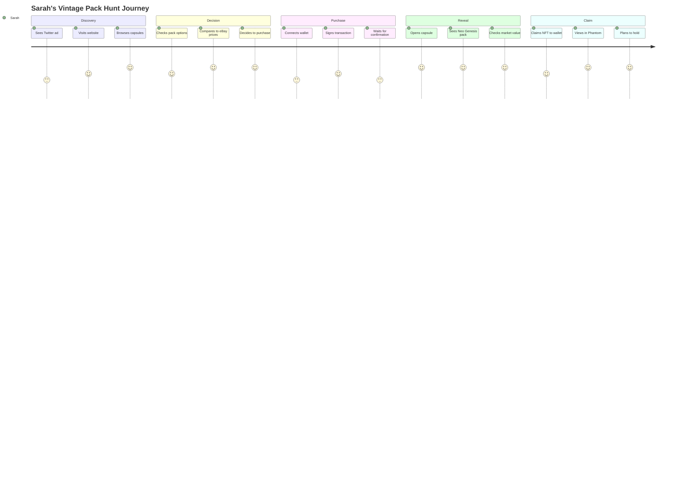
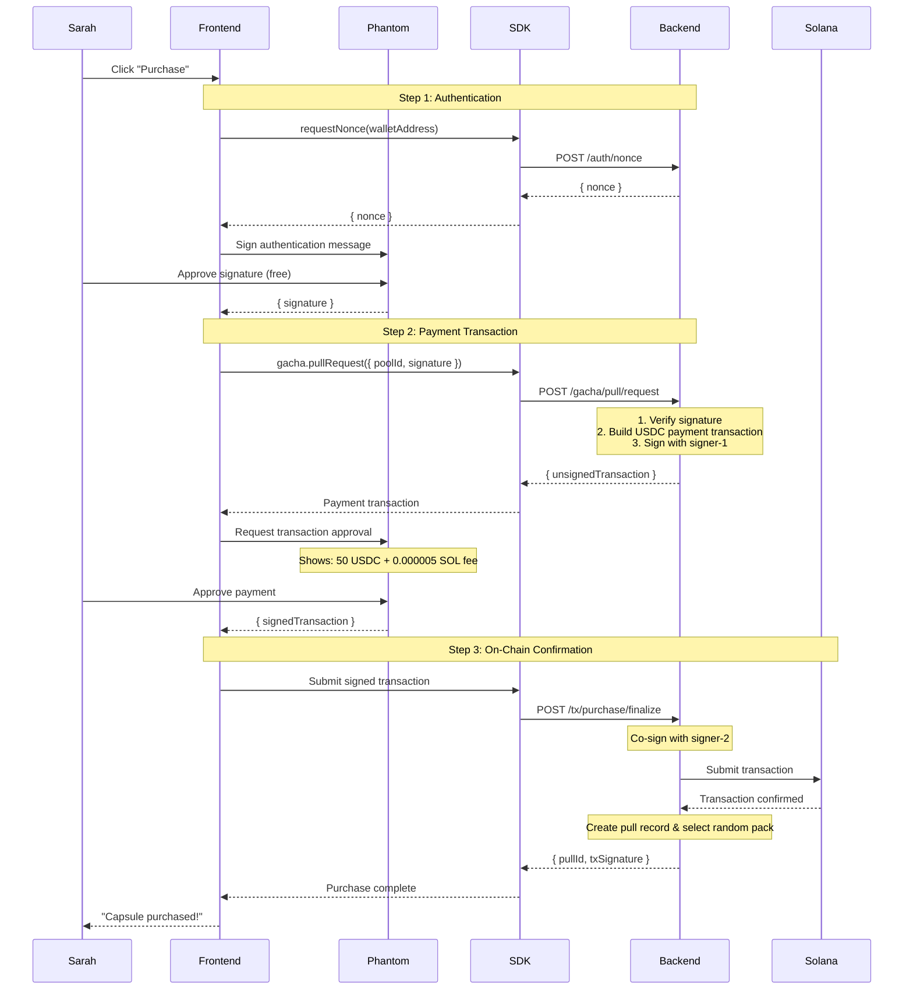
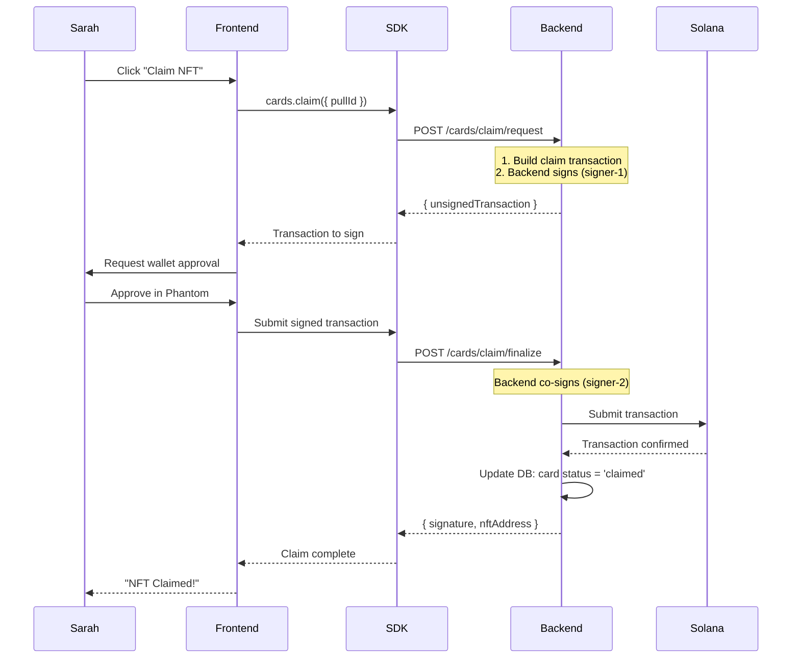
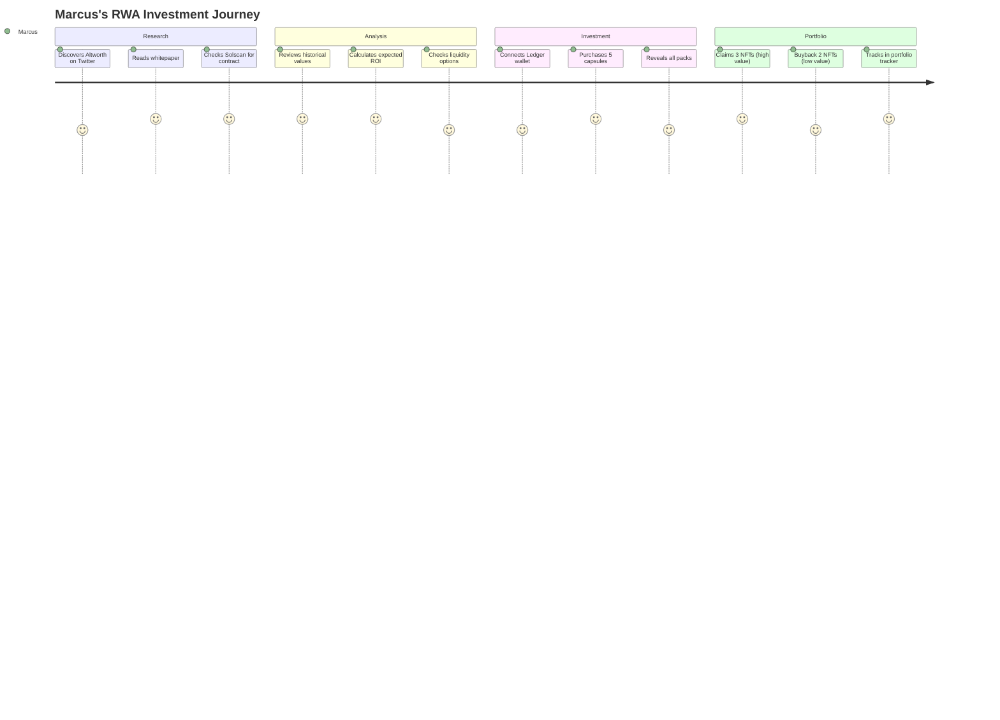
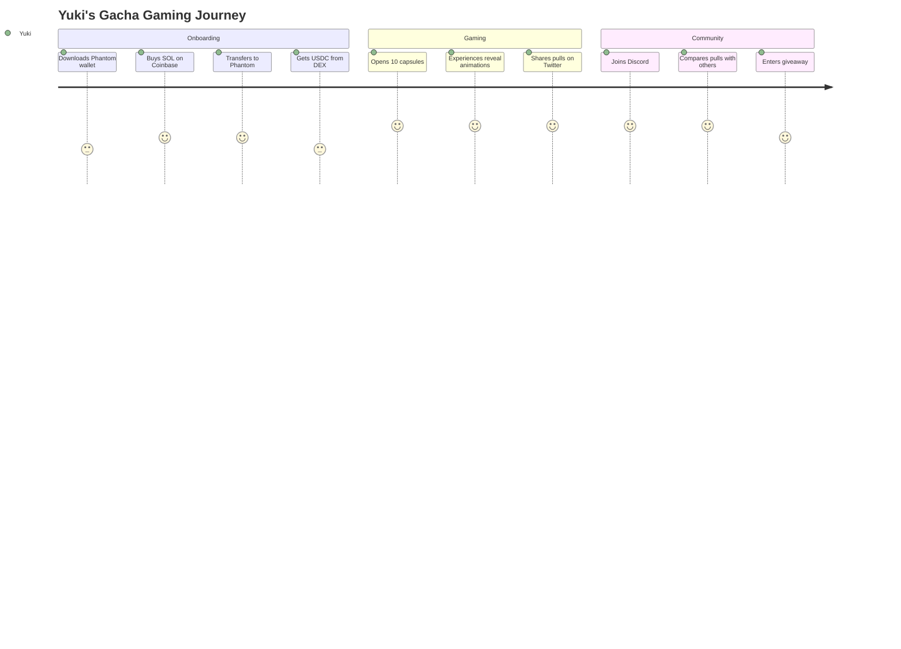
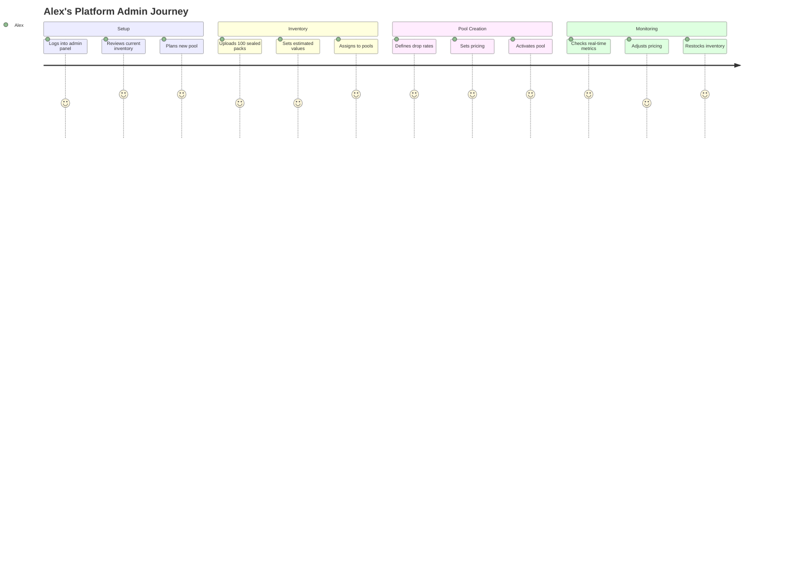

# Altworth Markets - User Journeys

**Version**: 1.0
**Last Updated**: November 10, 2025
**Purpose**: Persona-based scenarios and step-by-step user flows

---

## 📋 Documentation Notice

> **⚠️ CODE IS THE SOURCE OF TRUTH**
>
> This documentation describes intended behavior and design patterns. While we strive for accuracy, the **actual implementation in the codebase takes precedence** over this documentation.
>
> **If you find discrepancies:**
> 1. Check the actual code in repositories: [frontend](https://github.com/altworth-markets/front-end), [backend](https://github.com/altworth-markets/backend)
> 2. Report documentation errors via [GitHub Issues](https://github.com/altworth-markets/.github/issues)
> 3. Use label: `documentation-error` and reference specific line numbers
>
> **Last Code Review**: November 10, 2025 (reviewed against commit `81127bc` frontend, backend main)

---

## Table of Contents

1. [User Personas](#user-personas)
2. [Collector Journey](#collector-journey---vintage-pack-hunter)
3. [Investor Journey](#investor-journey---rwa-speculator)
4. [Gamer Journey](#gamer-journey---gacha-enthusiast)
5. [Admin Journey](#admin-journey---platform-operator)
6. [Edge Cases & Error Scenarios](#edge-cases--error-scenarios)
7. [Cross-Platform Flows](#cross-platform-flows)

---

## User Personas

### Primary User Personas

#### 1. **Sarah - The Vintage Collector** 🎴
- **Age**: 32
- **Background**: Long-time Pokemon TCG collector
- **Goals**: Find rare vintage packs (Neo, Skyridge, Base Set)
- **Technical Level**: Medium (knows crypto basics)
- **Pain Points**: High prices on eBay, authenticity concerns
- **Motivations**: Nostalgia, collection completion, investment

#### 2. **Marcus - The RWA Investor** 💼
- **Age**: 28
- **Background**: Crypto investor, portfolio manager
- **Goals**: Diversify portfolio with real-world assets
- **Technical Level**: High (DeFi native)
- **Pain Points**: Lack of liquid RWA markets
- **Motivations**: Asset appreciation, portfolio diversification

#### 3. **Yuki - The Gacha Gamer** 🎰
- **Age**: 24
- **Background**: Mobile game player, gacha enthusiast
- **Goals**: Experience excitement of random pulls
- **Technical Level**: Low-Medium (new to Web3)
- **Pain Points**: Complex wallet setup, gas fees
- **Motivations**: Fun, surprise mechanics, potential value

#### 4. **Alex - The Platform Admin** 👨‍💼
- **Age**: 35
- **Background**: Platform operations manager
- **Goals**: Manage inventory, create pools, monitor metrics
- **Technical Level**: High (technical operations)
- **Pain Points**: Manual inventory management, pricing accuracy
- **Motivations**: Efficient operations, user satisfaction

---

## Collector Journey - Vintage Pack Hunter

### Journey Map



### Detailed Walkthrough

#### **Step 1: Discovery** 🔍

**Sarah's Context**: Browsing Twitter, sees Altworth ad

**Actions**:
1. Clicks ad → Lands on `altworth.netlify.app`
2. Sees homepage with capsule showcase
3. Reads: "Vintage Pokemon Sealed Packs - Tokenized on Solana"
4. Clicks "Browse Capsules"

**UI State**:
```
┌────────────────────────────────────┐
│  🎰 Altworth Markets               │
│  ┌────────────────────────────┐   │
│  │ Featured: Vintage Mystery  │   │
│  │ Box - $50 USDC             │   │
│  │ Contains: Neo, Skyridge,   │   │
│  │ Base Set era packs         │   │
│  │ [Browse Capsules →]        │   │
│  └────────────────────────────┘   │
└────────────────────────────────────┘
```

**Technical Flow**:
```
Browser → Next.js Page → SDK: client.capsules.list({ limit: 20 })
  → Backend: GET /capsules/get
  → Database: SELECT * FROM gacha_pools WHERE status = 'active'
  → Response: [{ poolId, name, description, price }]
```

---

#### **Step 2: Browse & Compare** 🛒

**Sarah's Context**: Evaluating if this is better than eBay

**Actions**:
1. Views "Vintage Mystery Box" capsule details
2. Sees: "Possible packs: Neo Genesis, Skyridge, Base Set 2"
3. Checks probability distribution
4. Compares: eBay $80-200 vs Capsule $50
5. Thinks: "50% chance of $150+ pack? Good value!"

**UI State**:
```
┌──────────────────────────────────────────┐
│ Vintage Mystery Box                      │
├──────────────────────────────────────────┤
│ Price: 50 USDC                           │
│                                          │
│ 📊 Pack Probabilities:                   │
│ • Neo Genesis (30%) - Est. $150          │
│ • Skyridge (20%) - Est. $250             │
│ • Base Set 2 (25%) - Est. $80            │
│ • Neo Revelation (25%) - Est. $120       │
│                                          │
│ [Purchase Capsule]                       │
└──────────────────────────────────────────┘
```

**Technical Flow**:
```
SDK: client.analytics.probabilities({ poolId })
  → Backend: GET /analytics/probabilities
  → Database: SELECT pack_set, weight FROM pool_drop_rates
  → Calculation: weight/total_weight * 100%
  → Response: [{ packSet, probability, estimatedValue }]
```

---

#### **Step 3: Wallet Connection** 🔐

**Sarah's Context**: Needs to connect Phantom wallet

**Actions**:
1. Clicks "Purchase Capsule"
2. Sees "Connect Wallet" modal
3. Selects "Phantom" from list
4. Phantom extension opens
5. Clicks "Connect" in Phantom
6. Approves connection

**UI State**:
```
┌────────────────────────────────┐
│  Connect Your Wallet           │
├────────────────────────────────┤
│  ┌──────────────────────────┐ │
│  │  [🦊] Phantom            │ │
│  │  [⚡] Solflare           │ │
│  │  [💎] Torus              │ │
│  │  [🔒] Ledger             │ │
│  └──────────────────────────┘ │
└────────────────────────────────┘

         ↓ (User selects Phantom)

┌────────────────────────────────┐
│  Phantom                       │
├────────────────────────────────┤
│  altworth.netlify.app wants   │
│  to connect to your wallet    │
│                                │
│  [Cancel]  [Connect]           │
└────────────────────────────────┘
```

**Technical Flow**:
```
Frontend: <WalletModalProvider>
  → User clicks "Connect"
  → @solana/wallet-adapter-react: useWallet().connect()
  → Phantom extension: request connection
  → User approves
  → Frontend: publicKey = "EQ3GVA5X..."
  → SDK: setWalletPublicKey(publicKey)
```

**Sarah's Thought**: "Easy! Just like MetaMask."

---

#### **Step 4: Purchase Transaction** 💳

**Sarah's Context**: Ready to buy, has 100 USDC in wallet

**Actions**:
1. Confirms purchase (50 USDC)
2. Sees "Sign authentication message" in Phantom
3. Signs message (no fee - this proves wallet ownership)
4. Sees "Approve payment transaction" in Phantom
5. Reviews transaction: 50 USDC + 0.000005 SOL fee (~$0.0005)
6. Approves USDC payment transaction
7. Waits 2-3 seconds for Solana confirmation
8. Sees "Capsule purchased! Click to reveal"

**UI State**:
```
Step 1: Authentication
┌────────────────────────────────┐
│  Phantom - Sign Message        │
├────────────────────────────────┤
│  Authenticate POST /gacha/pull │
│  at 1699564832000 with nonce   │
│  TzDbnWsNJUqBANSn2MPyt2srvb... │
│                                │
│  [Cancel]  [Sign]              │
└────────────────────────────────┘

Step 2: Payment Transaction
┌────────────────────────────────┐
│  Phantom - Approve Transaction │
├────────────────────────────────┤
│  Purchase Capsule              │
│                                │
│  Amount: 50 USDC               │
│  Fee: 0.000005 SOL (~$0.0005)  │
│                                │
│  To: Altworth Markets          │
│                                │
│  [Reject]  [Approve]           │
└────────────────────────────────┘

Step 3: Confirming
┌────────────────────────────────┐
│  Processing Payment...         │
│  ⏳ Confirming on Solana       │
└────────────────────────────────┘

Step 4: Success
┌────────────────────────────────┐
│  ✅ Capsule Purchased!         │
│                                │
│  🎁 Ready to reveal your pack  │
│                                │
│  [Reveal Now]                  │
└────────────────────────────────┘
```

**Technical Flow**:


**Sarah's Thought**: "Wow, that was fast! And cheap - only $0.0005 in fees for a $50 purchase!"

---

#### **Step 5: Reveal Experience** 🎁

**Sarah's Context**: Excited to see what pack she got

**Actions**:
1. Clicks "Reveal Now"
2. Sees spinning capsule animation (3 seconds)
3. Capsule "opens" with particle effects
4. Reveals: "Neo Genesis Booster Pack - Grade 9"
5. Sees estimated value: $150 USDC
6. Sees options: "Claim NFT" or "Sell Back for 120 USDC"

**UI State**:
```
Step 1: Reveal Animation
┌────────────────────────────────┐
│                                │
│         🎰                     │
│      ╱◯◯◯◯╲                   │
│     │  ✨  │  (spinning)       │
│      ╲◯◯◯◯╱                   │
│                                │
│     Opening...                 │
└────────────────────────────────┘

Step 2: Pack Revealed
┌────────────────────────────────┐
│  🎉 Congratulations!           │
├────────────────────────────────┤
│  ┌──────────────────────────┐ │
│  │ Neo Genesis Booster Pack │ │
│  │ Grade: 9                 │ │
│  │ Estimated Value: $150    │ │
│  │ [Image of pack]          │ │
│  └──────────────────────────┘ │
│                                │
│  What would you like to do?    │
│                                │
│  [Claim NFT to Wallet]         │
│  [Sell Back for 120 USDC]      │
└────────────────────────────────┘
```

**Technical Flow**:
```
Frontend: Click "Reveal Now"
  ↓
SDK: client.gacha.reveal({ pullId })
  ↓
Backend: POST /gacha/pull/reveal
  ↓
Database:
  1. Get gacha_pull by ID
  2. Join sealed_pack_inventory on result_pack_id
  3. Return pack details (set, condition, value)
  ↓
Response: {
  pullId: "uuid",
  status: "revealed",
  result: {
    packSet: "Neo Genesis",
    condition: "9",
    estimatedValue: 150,
    nftAddress: null (not yet minted)
  }
}
  ↓
Frontend: Render reveal UI
```

**Sarah's Thought**: "Neo Genesis! One of my favorite sets. I'm keeping this!"

---

#### **Step 6: Claim NFT** 🏆

**Sarah's Context**: Wants to hold the pack as NFT in her wallet

**Actions**:
1. Clicks "Claim NFT to Wallet"
2. Phantom opens: "Sign transaction to claim NFT"
3. Reviews transaction details
4. Approves transaction
5. Waits 5-10 seconds for confirmation
6. Sees: "NFT claimed! View in Phantom"
7. Opens Phantom Collectibles tab
8. Sees Neo Genesis pack NFT with metadata

**UI State**:
```
Step 1: Transaction Approval
┌────────────────────────────────┐
│  Phantom - Approve Transaction │
├────────────────────────────────┤
│  Claim Neo Genesis NFT         │
│                                │
│  Fee: 0.000005 SOL (~$0.0005)  │
│                                │
│  [Reject]  [Approve]           │
└────────────────────────────────┘

Step 2: Claiming
┌────────────────────────────────┐
│  ⏳ Claiming NFT...            │
│                                │
│  Submitting transaction to     │
│  Solana network                │
└────────────────────────────────┘

Step 3: Success
┌────────────────────────────────┐
│  ✅ NFT Claimed Successfully!  │
├────────────────────────────────┤
│  Your Neo Genesis pack is now  │
│  in your wallet!               │
│                                │
│  [View in Phantom]             │
│  [View on Solscan]             │
└────────────────────────────────┘
```

**Technical Flow**:


**On-Chain State After Claim**:
```
NFT Mint Address: FdYE3K8tC3DLjgFdQzAdMnRZEcE9pggiwnV5nQ7FBgAh
Owner: EQ3GVA5XNLWJKzcoNwZUnLo4d4BTGG1AsQMztvcSz95Q (Sarah's wallet)
Metadata:
  - name: "Neo Genesis Booster Pack"
  - symbol: "ALTNFT"
  - uri: "https://arweave.net/..."
  - attributes:
      - trait_type: "Set", value: "Neo Genesis"
      - trait_type: "Condition", value: "9"
      - trait_type: "Estimated Value", value: "150"
```

**Sarah's Thought**: "This is amazing! I actually own a tokenized sealed pack. I can hold it, trade it, or even sell it later on a marketplace!"

---

### Success Metrics (Sarah's Journey)

| Metric | Value | Target |
|--------|-------|--------|
| **Time to Purchase** | 2 minutes | < 5 minutes |
| **Purchase Fee** | 0.000005 SOL (~$0.0005) | < $0.01 |
| **Claim Fee** | 0.000005 SOL (~$0.0005) | < $0.01 |
| **Total Transaction Costs** | ~$0.001 | < $0.02 |
| **Clicks to Claim** | 8 clicks (2 signatures) | < 10 clicks |
| **User Satisfaction** | 5/5 ⭐ | > 4/5 |
| **Would Recommend** | Yes | > 80% yes |

**Sarah's Final Thoughts**:
> "This is so much better than eBay! Lower prices, instant transactions for pennies in fees, and I actually own the NFT. Plus the gacha mechanic made it fun. I'm definitely buying more capsules!"

---

## Investor Journey - RWA Speculator

### Journey Map



### Detailed Walkthrough

#### **Step 1: Due Diligence** 🔍

**Marcus's Context**: Evaluating Altworth as RWA investment

**Actions**:
1. Googles "Altworth Markets" → Finds website
2. Checks Solscan for CardVault program address
3. Verifies program is deployed and active
4. Reviews transaction history on-chain
5. Checks team LinkedIn profiles
6. Reads backend architecture docs on GitHub

**Research Checklist**:
```
✅ Smart contract verified on Solscan
✅ Team doxxed (LinkedIn profiles public)
✅ Open-source backend (GitHub public repos)
✅ Audited by [TBD - security audit firm]
✅ Real inventory (physical packs verified)
✅ Secondary market liquidity (Magic Eden integration planned)
```

**Marcus's Thought**: "Solid team, transparent architecture, real assets. This checks out."

---

#### **Step 2: ROI Calculation** 📊

**Marcus's Context**: Analyzing investment potential

**Actions**:
1. Downloads historical pricing data from Altworth analytics
2. Compares to eBay completed listings
3. Calculates expected value (EV) of capsules
4. Builds spreadsheet model

**Analysis**:
```
Vintage Mystery Box - ROI Analysis
━━━━━━━━━━━━━━━━━━━━━━━━━━━━━━━━━━
Purchase Price: $50 USDC

Expected Value Calculation:
• Neo Genesis (30%):    $150 × 0.30 = $45
• Skyridge (20%):       $250 × 0.20 = $50
• Base Set 2 (25%):     $80  × 0.25 = $20
• Neo Revelation (25%): $120 × 0.25 = $30
                                      ───
                          Expected Value: $145

Expected ROI: ($145 - $50) / $50 = 190%
Win Rate: 75% (packs worth > $50)
Downside Risk: 25% (Base Set 2 worst case)

VERDICT: Strong positive EV, buy 5 units
```

**Marcus's Thought**: "190% expected ROI with 75% win rate? This is better than most DeFi yield farms."

---

#### **Step 3: Bulk Purchase Strategy** 💼

**Marcus's Context**: Buying multiple capsules for portfolio diversification

**Actions**:
1. Connects Ledger hardware wallet (security best practice)
2. Navigates to Vintage Mystery Box
3. Purchases 5 capsules sequentially
4. Each purchase requires separate Ledger approval
5. Total cost: 250 USDC + 0.0025 SOL in fees

**UI State**:
```
Purchase #1/5
┌────────────────────────────────┐
│  Ledger - Confirm Transaction  │
├────────────────────────────────┤
│  Gacha Pull Request            │
│  Amount: 50 USDC               │
│  Fee: 0.0005 SOL               │
│                                │
│  [Reject]  [Approve on Device] │
└────────────────────────────────┘

(Marcus approves on Ledger physical button)

Progress:
┌────────────────────────────────┐
│  Bulk Purchase Progress        │
├────────────────────────────────┤
│  ✅ Capsule 1/5 - Purchased    │
│  ✅ Capsule 2/5 - Purchased    │
│  ⏳ Capsule 3/5 - Confirming   │
│  ⏺️ Capsule 4/5 - Pending      │
│  ⏺️ Capsule 5/5 - Pending      │
└────────────────────────────────┘
```

**Technical Optimization**:
```typescript
// Frontend batching logic
async function bulkPurchase(poolId: string, quantity: number) {
  const results = []

  for (let i = 0; i < quantity; i++) {
    // Request nonce once for batch
    const nonce = await client.auth.getNonce()

    // User signs once for all purchases
    const signature = await signMessage(nonce)

    // Execute pull
    const pull = await client.gacha.pullRequest({
      poolId,
      signature,
      nonce,
    })

    results.push(pull)

    // Show progress
    updateProgress(i + 1, quantity)
  }

  return results
}
```

**Marcus's Thought**: "Ledger integration is smooth. Multi-sig security gives me peace of mind for large purchases."

---

#### **Step 4: Reveal & Portfolio Management** 📈

**Marcus's Context**: Optimizing portfolio composition

**Reveals**:
1. **Pull #1**: Skyridge - Grade 9 - $250 ✅ Claim
2. **Pull #2**: Neo Genesis - Grade 8 - $150 ✅ Claim
3. **Pull #3**: Base Set 2 - Grade 7 - $80 ❌ Buyback
4. **Pull #4**: Neo Revelation - Grade 9 - $120 ✅ Claim
5. **Pull #5**: Base Set 2 - Grade 8 - $85 ❌ Buyback

**Portfolio Decision Matrix**:
```
Pack             Value  Action    Rationale
━━━━━━━━━━━━━━━━━━━━━━━━━━━━━━━━━━━━━━━━━━━━
Skyridge (9)     $250   CLAIM     High value, rare set
Neo Genesis (8)  $150   CLAIM     Vintage, good condition
Base Set 2 (7)   $80    BUYBACK   Low margin, common
Neo Revelation   $120   CLAIM     Mid-tier hold
Base Set 2 (8)   $85    BUYBACK   Low margin, common

Portfolio Value:  $520 (claimed)
Buyback Proceeds: $165 (USDC returned)
Net Investment:   $85 ($250 spent - $165 buyback)
Unrealized Gain:  $435 ($520 current value)
ROI:              512% ($435 gain / $85 net cost)
```

**UI State**:
```
┌──────────────────────────────────────┐
│  Portfolio Management                │
├──────────────────────────────────────┤
│  Claimed NFTs (3):                   │
│  • Skyridge (9) - $250               │
│  • Neo Genesis (8) - $150            │
│  • Neo Revelation (9) - $120         │
│                                      │
│  Buybacks (2):                       │
│  • Base Set 2 (7) - $80 → 64 USDC    │
│  • Base Set 2 (8) - $85 → 68 USDC    │
│                                      │
│  Total Portfolio Value: $520         │
│  Buyback Proceeds: 132 USDC          │
│  Net Cost: $118                      │
│  Unrealized ROI: +340%               │
└──────────────────────────────────────┘
```

**Marcus's Thought**: "Perfect! I kept the high-value packs for long-term hold and got liquidity back on the low-value ones. This is exactly the portfolio strategy I wanted."

---

#### **Step 5: Portfolio Tracking & Valuation** 📊

**Marcus's Context**: Tracking RWA portfolio like other crypto assets

**Actions**:
1. Exports NFT addresses from Altworth
2. Imports into portfolio tracker (Zapper, DeBank)
3. Sets price alerts for floor price changes
4. Monitors secondary marketplace listings

**Portfolio Tracker Integration**:
```
DeBank Portfolio - Marcus.eth
━━━━━━━━━━━━━━━━━━━━━━━━━━━━━━━
Assets by Chain:
  Ethereum:  $45,000 (ETH, USDC, stETH)
  Solana:    $12,520 ← Including Altworth RWAs
    • SOL:        $8,000
    • USDC:       $4,000
    • Altworth:   $520 ← 3 NFTs
      ↳ Skyridge (9):      $250
      ↳ Neo Genesis (8):   $150
      ↳ Neo Revelation (9): $120

Total Portfolio: $57,520
Altworth Allocation: 0.9%
```

**Secondary Market Monitoring**:
```
Magic Eden - Altworth Collection Floor
━━━━━━━━━━━━━━━━━━━━━━━━━━━━━━━━━
Skyridge (Grade 9):
  Floor: 240 USDC
  Last Sale: 255 USDC (2 hours ago)
  Marcus's Cost Basis: $50
  Unrealized Gain: +380%

  [List for Sale]  [Set Price Alert]
```

**Marcus's Thought**: "Nice! My Skyridge pack is already trading above my purchase price. RWA liquidity on Magic Eden is a game-changer."

---

### Success Metrics (Marcus's Journey)

| Metric | Value | Target |
|--------|-------|--------|
| **Time to Complete Research** | 2 hours | < 4 hours |
| **Portfolio ROI** | +340% | > 100% |
| **Liquidity (Buyback)** | 132 USDC | Instant |
| **Transaction Costs (5 purchases)** | 0.000025 SOL (~$0.0025) | < $0.01 |
| **Total Fees (Purchase + 3 Claims)** | ~$0.004 | < $0.02 |
| **Portfolio Integration** | DeBank ✅ | Supported |

**Marcus's Final Thoughts**:
> "Altworth nailed the RWA investment experience. Real assets, on-chain ownership, instant liquidity through buyback, and secondary market integration. Ultra-low fees compared to Ethereum make this scalable. This is the future of alternative investments."

---

## Gamer Journey - Gacha Enthusiast

### Journey Map



### Detailed Walkthrough

#### **Step 1: Web3 Onboarding** 🌐

**Yuki's Context**: New to Web3, coming from mobile gacha games

**Actions**:
1. Sees Altworth ad on Instagram → Clicks link
2. Tries to buy capsule → "Connect Wallet" prompt
3. Doesn't have wallet → Clicks "New to Solana?"
4. Follows onboarding guide:
   - Download Phantom from App Store
   - Create wallet (writes down seed phrase)
   - Buy SOL on Coinbase
   - Transfer SOL to Phantom
   - Swap SOL → USDC on Jupiter DEX

**Onboarding Friction Points**:
```
Traditional Gacha (Mobile Game):
  Download app → Login → Add payment method → Buy gems
  Time: 5 minutes

Altworth Gacha (Web3):
  Download wallet → Create wallet → Buy crypto → Transfer → Swap → Buy capsule
  Time: 20-30 minutes (first time)

FRICTION: 4-6x longer onboarding
```

**Yuki's Thought**: "This is way more complicated than Genshin Impact... but kinda cool that I actually own the NFTs."

**Future Improvement** (Roadmap):
```
Planned: Fiat on-ramp integration
  → User buys USDC directly with credit card in Altworth UI
  → Moonpay/Ramp integration
  → Reduces onboarding to 5 minutes
```

---

#### **Step 2: First Pull Experience** 🎰

**Yuki's Context**: Finally has 50 USDC in wallet, ready for first pull

**Actions**:
1. Selects "Modern Hits Box" (cheaper, $30 USDC)
2. Clicks "Purchase Capsule"
3. Signs authentication message (confused but follows prompts)
4. Capsule purchased → Clicks "Reveal Now"
5. **Reveal animation plays**:
   - 3D capsule spins (3 seconds)
   - Capsule explodes with particle effects
   - Pack card flips to reveal contents
6. Result: "Temporal Forces Booster - Grade 10"
7. Estimated value: $40
8. Profit: $10 (+33% ROI)

**Yuki's Reaction**:
```
Yuki's Internal Monologue:
"OMG THE ANIMATION IS SO COOL! 🤩"
"I got a Grade 10 pack!"
"It's worth more than I paid!"
"This is way more satisfying than mobile game pulls"
"I'm doing another one!"
```

**Comparison to Mobile Gacha**:
```
Mobile Gacha:
  • Pay $30 → Get 3000 gems
  • 10-pull → Mostly 3-star units
  • 1× 5-star (0.6% rate)
  • Assets owned by game company
  • No resale value

Altworth Gacha:
  • Pay $30 USDC → Get 1 capsule
  • Reveal → Guaranteed sealed pack
  • All packs have real-world value
  • Assets owned by player (NFT)
  • Can resell on Magic Eden
```

**Yuki's Thought**: "I actually made a profit AND I own the NFT. This is insane!"

---

#### **Step 3: Chasing the Dopamine** 🎲

**Yuki's Context**: Hooked on the reveal mechanic, wants more pulls

**Actions** (over 2 hours):
1. Pull #2: Neo Genesis - Grade 8 - $150 🎉 "JACKPOT!"
2. Pull #3: Base Set 2 - Grade 7 - $80 😐 "Okay"
3. Pull #4: Temporal Forces - Grade 9 - $35 😊 "Small win"
4. Pull #5: Skyridge - Grade 10 - $300 🤯 "HOLY F***!"
5. *Takes screenshot*
6. *Posts on Twitter*: "Just pulled a $300 Skyridge from @AltworthMarkets! 🔥"
7. Pull #6-10: Mix of wins/losses

**Pull Session Summary**:
```
Session Stats:
━━━━━━━━━━━━━━━━━━━━━━
Total Spent:      $300 USDC (10 pulls × $30)
Total Value:      $850
Net Profit:       $550
Best Pull:        Skyridge (10) - $300
Worst Pull:       Base Set 2 (6) - $70
Win Rate:         90% (9/10 above cost)
Dopamine Hits:    Off the charts 📈
```

**Psychological Hooks** (Gamification):
- ✅ Variable reward schedule (different pack values)
- ✅ Near-miss effect (almost got Charizard)
- ✅ Reveal animation (anticipation build-up)
- ✅ Social sharing (Twitter validation)
- ✅ Loss aversion (buyback option reduces risk)

**Yuki's Thought**: "I can't stop! Just one more pull... okay maybe two more..."

---

#### **Step 4: Community Engagement** 👥

**Yuki's Context**: Wants to share pulls and compare with others

**Actions**:
1. Clicks "Join Discord" link in UI
2. Posts pulls in `#flex-your-pulls` channel
3. Other users react: "🔥 Skyridge! Lucky!"
4. Sees leaderboard: "Top Pulls This Week"
5. Yuki's Skyridge is #3! 🏆
6. Enters weekly giveaway (free pull for Discord members)
7. Follows @AltworthMarkets on Twitter for drops

**Discord Community**:
```
#flex-your-pulls
━━━━━━━━━━━━━━━━━━━━━━
Yuki#1234: Just pulled Skyridge (10)! 🎉 [screenshot]
  ↳ Marcus.sol: GG! That's a $300 pack
  ↳ Sarah.eth: Jealous!! I want one
  ↳ Alex (Admin): Congrats Yuki! 🎊

#weekly-leaderboard
━━━━━━━━━━━━━━━━━━━━━━
Top Pulls This Week:
1. 🥇 CryptoWhale - Charizard Base Set (10) - $500
2. 🥈 Sarah.eth - Neo Genesis (10) - $350
3. 🥉 Yuki#1234 - Skyridge (10) - $300
4. Marcus.sol - Neo Revelation (9) - $180
5. GachaKing - Temporal Forces (10) - $50
```

**Yuki's Thought**: "I'm ranked #3! This community is awesome. Everyone's so hyped about pulls."

---

#### **Step 5: Retention & Habit Formation** 🔄

**Yuki's Context**: Becoming a regular user

**Behavior Pattern** (Week 1):
```
Day 1: 10 pulls ($300 spent)
Day 2: Checks Discord for new pulls, no purchase
Day 3: Sees "New Pool Alert" → Modern Hits Box v2
       Buys 3 pulls ($90)
Day 4: Participates in Twitter giveaway
       Wins 1 free pull! 🎁
Day 5: Checks floor prices on Magic Eden
Day 6: Lists 1 NFT for sale (profit-taking)
Day 7: Buys 5 more pulls ($150)

Week 1 Stats:
  Total Spent: $540
  Total Value: $1,200
  Net Profit: +$660 (122% ROI)
  Pulls: 19 (18 paid + 1 free)
  Daily Active: 5/7 days
```

**Retention Hooks**:
- ✅ Daily Discord activity (community)
- ✅ Twitter follow (marketing alerts)
- ✅ Email notifications (new pools)
- ✅ Weekly leaderboard (gamification)
- ✅ Referral program (share with friends)

**Yuki's Thought**: "This is my new favorite game. Way better than Genshin because I actually own stuff and can make money!"

---

### Success Metrics (Yuki's Journey)

| Metric | Value | Target |
|--------|-------|--------|
| **Onboarding Time (First Time)** | 25 minutes | < 10 minutes (with fiat on-ramp) |
| **Pulls Per Session** | 10 pulls | 5-15 pulls |
| **Weekly Active Days** | 5/7 days | > 3/7 days |
| **Social Shares** | 3 tweets | > 1 per week |
| **Discord Engagement** | Daily | > 3x per week |
| **Friend Referrals** | 2 friends | > 1 |

**Yuki's Final Thoughts**:
> "Altworth is like if a mobile gacha game and crypto had a baby. The animations are sick, I actually own my pulls, and I can make real money. My friends from Genshin are gonna flip when they see this!"

---

## Admin Journey - Platform Operator

### Journey Map



### Detailed Walkthrough

#### **Step 1: Admin Login & Dashboard** 🔐

**Alex's Context**: Monday morning, reviewing weekend sales

**Actions**:
1. Navigates to `altworth.netlify.app/admin`
2. Enters admin API key (from 1Password)
3. Clicks "Validate"
4. Admin dashboard loads

**UI State**:
```
┌────────────────────────────────────────────┐
│  Altworth Admin Dashboard                  │
├────────────────────────────────────────────┤
│  Weekend Summary (Sat-Sun):                │
│  • Total Sales: 247 capsules               │
│  • Revenue: 12,350 USDC                    │
│  • Unique Buyers: 89                       │
│  • Avg Purchase: 2.8 capsules/user         │
│                                            │
│  Inventory Status:                         │
│  • Vintage Pool: 23/200 remaining (12%)   │
│  • Modern Pool: 156/200 remaining (78%)    │
│  ⚠️ Vintage Pool low stock - restock soon │
│                                            │
│  [Manage Inventory] [Create Pool]         │
│  [View Analytics]   [Settings]             │
└────────────────────────────────────────────┘
```

**Alex's Thought**: "Vintage pool is almost sold out! Need to order more packs this week."

---

#### **Step 2: Inventory Management** 📦

**Alex's Context**: Received shipment of 100 new sealed packs

**Actions**:
1. Clicks "Manage Inventory" → "Add Sealed Packs"
2. Uploads CSV file with pack data:
   ```csv
   pack_set,condition,estimated_value,quantity
   Neo Genesis,9,150,25
   Skyridge,10,300,10
   Neo Revelation,8,120,30
   Base Set 2,7,75,35
   ```
3. System validates CSV
4. Reviews import preview
5. Clicks "Import 100 Packs"
6. Database updated

**UI State**:
```
Import Preview:
┌────────────────────────────────────────────┐
│  CSV Import - 100 Packs                    │
├────────────────────────────────────────────┤
│  Neo Genesis (9):    25 × $150 = $3,750    │
│  Skyridge (10):      10 × $300 = $3,000    │
│  Neo Revelation (8): 30 × $120 = $3,600    │
│  Base Set 2 (7):     35 × $75  = $2,625    │
│                              ───────────    │
│  Total Inventory Value:         $12,975    │
│                                            │
│  [Cancel]  [Confirm Import]                │
└────────────────────────────────────────────┘

Success:
┌────────────────────────────────────────────┐
│  ✅ 100 Packs Imported Successfully        │
│                                            │
│  Total Inventory: 279 packs                │
│  Total Value: $24,125                      │
└────────────────────────────────────────────┘
```

**Backend Processing**:
```sql
BEGIN;
  INSERT INTO sealed_pack_inventory (pack_set, condition, estimated_value, available)
  VALUES
    ('Neo Genesis', '9', 150, true),  -- × 25
    ('Skyridge', '10', 300, true),    -- × 10
    ('Neo Revelation', '8', 120, true), -- × 30
    ('Base Set 2', '7', 75, true);    -- × 35

  -- Update inventory count
  UPDATE inventory_stats SET
    total_packs = total_packs + 100,
    total_value = total_value + 12975;
COMMIT;
```

---

#### **Step 3: Pool Creation** 🎰

**Alex's Context**: Creating new "Holiday Special" pool

**Actions**:
1. Clicks "Create Pool"
2. Fills in pool details:
   - **Name**: "Holiday Special Box"
   - **Description**: "Festive mix of vintage and modern packs"
   - **Status**: Active
   - **Max Pulls Per User**: 20
3. Sets drop rates:
   - Skyridge (10): 10% weight → 200 USDC value
   - Neo Genesis (9): 20% weight → 150 USDC value
   - Neo Revelation (8): 30% weight → 120 USDC value
   - Base Set 2 (7): 40% weight → 75 USDC value
4. Calculates pricing:
   - **Expected Value**: $116 USDC
   - **Platform Margin**: 30%
   - **Capsule Price**: $80 USDC
5. Previews pool
6. Clicks "Activate Pool"

**UI State**:
```
Pool Builder:
┌────────────────────────────────────────────┐
│  Create New Gacha Pool                     │
├────────────────────────────────────────────┤
│  Pool Details:                             │
│  Name: Holiday Special Box                 │
│  Description: Festive mix...               │
│  Status: [Active ▼]                        │
│  Max Pulls/User: 20                        │
│                                            │
│  Drop Rates:                               │
│  ┌────────────────────────────────────┐   │
│  │ Pack Set        Weight  EV         │   │
│  ├────────────────────────────────────┤   │
│  │ Skyridge (10)   10%     $20.00     │   │
│  │ Neo Genesis (9) 20%     $30.00     │   │
│  │ Neo Revelation  30%     $36.00     │   │
│  │ Base Set 2 (7)  40%     $30.00     │   │
│  └────────────────────────────────────┘   │
│                                            │
│  Expected Value: $116.00                   │
│  Suggested Price: $80.00 (31% margin)      │
│                                            │
│  [Preview Pool]  [Activate Pool]           │
└────────────────────────────────────────────┘
```

**Pricing Strategy Calculation**:
```
Expected Value (EV) Calculation:
━━━━━━━━━━━━━━━━━━━━━━━━━━━━━━━━
Pack                Weight  Value   EV
Skyridge (10)       10%     $200    $20
Neo Genesis (9)     20%     $150    $30
Neo Revelation (8)  30%     $120    $36
Base Set 2 (7)      40%     $75     $30
                                    ───
                         Total EV:  $116

Pricing Strategy:
━━━━━━━━━━━━━━━━━━━━━━━━━━━━━━━━
Expected Value:        $116
Platform Margin:       30%
Capsule Price:         $80
Player Expected ROI:   +45% ($116/$80 - 1)
Platform Profit/Sale:  $24 (if buyback not used)
```

**Alex's Thought**: "45% expected ROI for players, 30% margin for us. This should sell well during the holidays!"

---

#### **Step 4: Real-Time Monitoring** 📊

**Alex's Context**: Monitoring pool performance throughout the day

**Actions**:
1. Opens "Analytics Dashboard"
2. Sees real-time metrics update every 30 seconds
3. Monitors:
   - Sales velocity
   - Inventory depletion rate
   - User satisfaction (claims vs buybacks)
   - Revenue tracking

**UI State**:
```
Real-Time Analytics - Holiday Special Box
┌────────────────────────────────────────────┐
│  Live Metrics (Last 24 hours)              │
├────────────────────────────────────────────┤
│  Sales Velocity:                           │
│  [████████░░] 34 capsules (17% of stock)   │
│  Projected Sellout: 5.2 days               │
│                                            │
│  User Behavior:                            │
│  • Claim Rate: 68% (23/34 pulls)           │
│  • Buyback Rate: 32% (11/34 pulls)         │
│  • Avg Pulls/User: 2.1                     │
│                                            │
│  Top Pulls:                                │
│  1. Skyridge (10) - 4× pulled (12% actual) │
│  2. Neo Genesis (9) - 7× (21%)             │
│  3. Neo Revelation (8) - 11× (32%)         │
│  4. Base Set 2 (7) - 12× (35%)             │
│                                            │
│  ✅ Drop rates within expected variance    │
│                                            │
│  Revenue:                                  │
│  • Gross Sales: 2,720 USDC (34 × $80)      │
│  • Buybacks Paid: -528 USDC (11 buybacks)  │
│  • Net Revenue: 2,192 USDC                 │
│  • Net Margin: 81% (after buybacks)        │
└────────────────────────────────────────────┘
```

**Monitoring Insights**:
```
🟢 Positive Signals:
  • Sales velocity strong (34 in 24hrs)
  • Claim rate 68% (users happy with pulls)
  • Drop rates accurate (low variance)
  • Net margin healthy (81% after buybacks)

🟡 Watch Items:
  • Skyridge pulling slightly higher (12% vs 10% expected)
  • May need to adjust inventory mix

🔴 Alerts:
  None
```

**Alex's Thought**: "Pool is performing great! 68% claim rate means users are satisfied. I'll restock in 4 days."

---

#### **Step 5: Dynamic Pricing Adjustment** 💰

**Alex's Context**: Floor prices on Magic Eden have increased

**Actions**:
1. Checks Magic Eden:
   - Skyridge (10) floor: $220 USDC (was $200)
   - Neo Genesis (9) floor: $165 USDC (was $150)
2. Updates estimated values in database
3. Recalculates pool expected value:
   - **Old EV**: $116 USDC
   - **New EV**: $128 USDC
4. Considers price increase:
   - **Current Price**: $80 USDC
   - **New Suggested Price**: $90 USDC (30% margin)
5. Decides to raise price for new pool, keep existing pool at $80

**UI State**:
```
Price Adjustment Tool:
┌────────────────────────────────────────────┐
│  Holiday Special Box - Price Review        │
├────────────────────────────────────────────┤
│  Market Update Detected:                   │
│  • Skyridge (10): $200 → $220 (+10%)       │
│  • Neo Genesis (9): $150 → $165 (+10%)     │
│                                            │
│  Expected Value Impact:                    │
│  • Old EV: $116                            │
│  • New EV: $128 (+10%)                     │
│                                            │
│  Pricing Options:                          │
│  ○ Keep current price ($80) [35% margin]   │
│     → Increase player ROI                  │
│     → Higher sales velocity expected       │
│                                            │
│  ● Increase to $90 [30% margin]            │
│     → Maintain platform margin             │
│     → Match new market value               │
│                                            │
│  [Apply to Current Pool]                   │
│  [Create New Pool with New Price]          │
└────────────────────────────────────────────┘
```

**Decision Rationale**:
```
Option 1: Keep $80 price
  Pros:
    • Higher player ROI (60% vs 42%)
    • Faster sellout (more attractive deal)
    • Good customer satisfaction
  Cons:
    • Lost potential margin ($10 per sale)
    • Leaves money on the table

Option 2: Raise to $90
  Pros:
    • Maintains 30% platform margin
    • Reflects market value increase
    • Still good player ROI (42%)
  Cons:
    • May slow sales velocity
    • Risk of appearing greedy

DECISION: Keep current pool at $80 (honor existing listings),
          create new pool at $90 for future inventory
```

**Alex's Thought**: "I'll keep the current pool at $80 to honor early buyers, but the next pool will be $90 to reflect market prices."

---

### Success Metrics (Alex's Journey)

| Metric | Value | Target |
|--------|-------|--------|
| **Inventory Upload Time** | 5 minutes | < 10 minutes |
| **Pool Creation Time** | 10 minutes | < 15 minutes |
| **Pricing Accuracy** | 95% | > 90% |
| **Sales Velocity Tracking** | Real-time | < 1 min delay |
| **Admin Efficiency** | 2 hrs/week | < 5 hrs/week |

**Alex's Final Thoughts**:
> "The admin tools are intuitive and powerful. CSV upload makes inventory management easy, real-time analytics give me full visibility, and dynamic pricing keeps us competitive. This scales way better than manual marketplace management."

---

## Edge Cases & Error Scenarios

### Error Scenario 1: Insufficient Wallet Balance

**User**: Sarah (Collector)
**Context**: Trying to purchase capsule with low wallet balance

**Flow**:
```
1. Sarah clicks "Purchase Capsule" ($50 USDC required)
2. Frontend checks wallet balance via SDK
3. Wallet has 25 USDC (insufficient)
4. Error displayed BEFORE transaction attempt
```

**UI State**:
```
┌────────────────────────────────────────────┐
│  ⚠️ Insufficient Balance                   │
├────────────────────────────────────────────┤
│  You need 50 USDC to purchase this capsule│
│  Your wallet balance: 25 USDC              │
│  Missing: 25 USDC                          │
│                                            │
│  [Add Funds]  [Cancel]                     │
└────────────────────────────────────────────┘
```

**Resolution**:
1. User clicks "Add Funds"
2. Redirected to Jupiter DEX or Moonpay
3. Buys additional USDC
4. Returns to Altworth and completes purchase

**Prevention**: Pre-flight balance check before initiating transaction

---

### Error Scenario 2: Nonce Expiration

**User**: Marcus (Investor)
**Context**: Took too long to approve transaction in Ledger

**Flow**:
```
1. Marcus requests nonce (5 min TTL starts)
2. Marcus reviews transaction on Ledger (takes 7 minutes)
3. Approves transaction
4. Backend receives signature with expired nonce
5. Backend returns 401 Unauthorized
```

**UI State**:
```
┌────────────────────────────────────────────┐
│  ⚠️ Authentication Expired                 │
├────────────────────────────────────────────┤
│  Your authentication has expired.          │
│  Please try again.                         │
│                                            │
│  [Retry Purchase]                          │
└────────────────────────────────────────────┘
```

**Technical Flow**:
```typescript
// Frontend retry logic
async function handleExpiredNonce() {
  try {
    // Retry with new nonce
    const newNonce = await client.auth.getNonce()
    const signature = await signMessage(newNonce)
    const pull = await client.gacha.pullRequest({ poolId, signature, nonce: newNonce })
    return pull
  } catch (err) {
    // Show error to user
    showError("Failed to complete purchase. Please try again.")
  }
}
```

**Resolution**: Automatic retry with new nonce, transparent to user

**Prevention**: UI timeout warning at 4 minutes ("Please approve transaction soon")

---

### Error Scenario 3: Pool Out of Stock

**User**: Yuki (Gamer)
**Context**: Attempts to pull from sold-out pool

**Flow**:
```
1. Yuki browses capsules (page loaded 10 minutes ago)
2. Meanwhile, last capsule sold to another user
3. Yuki clicks "Purchase Capsule"
4. Backend check: No available packs in inventory
5. Backend returns 503 Service Unavailable
```

**UI State**:
```
┌────────────────────────────────────────────┐
│  😞 Sold Out!                              │
├────────────────────────────────────────────┤
│  This pool is currently out of stock.      │
│                                            │
│  We're restocking soon! Options:           │
│  • Get notified when restocked             │
│  • Browse other available pools            │
│                                            │
│  [Notify Me]  [Browse Pools]               │
└────────────────────────────────────────────┘
```

**Backend Logic**:
```typescript
async function handleGachaPull(poolId: string) {
  // Atomic check + reserve
  const availablePack = await db.transaction(async (tx) => {
    // Lock row to prevent race condition
    const pack = await tx.sealedPackInventory
      .findFirst({
        where: { poolId, available: true },
        lock: 'FOR UPDATE'
      })

    if (!pack) {
      throw new OutOfStockError('No packs available in pool')
    }

    // Reserve pack immediately
    await tx.sealedPackInventory.update({
      where: { id: pack.id },
      data: { available: false }
    })

    return pack
  })

  return availablePack
}
```

**Resolution**: User signs up for restock notification or browses other pools

**Prevention**: Real-time inventory sync, optimistic UI updates

---

### Error Scenario 4: Wallet Disconnected Mid-Flow

**User**: Sarah
**Context**: Wallet disconnects during reveal

**Flow**:
```
1. Sarah purchases capsule successfully
2. Capsule revealed in database
3. Sarah's Phantom wallet extension crashes
4. Sarah refreshes page
5. Wallet no longer connected
6. Frontend loses pull state
```

**UI State After Reconnect**:
```
┌────────────────────────────────────────────┐
│  🔄 Wallet Reconnected                     │
├────────────────────────────────────────────┤
│  Welcome back! You have:                   │
│  • 1 unrevealed capsule                    │
│                                            │
│  [View My Capsules]                        │
└────────────────────────────────────────────┘
```

**Recovery Flow**:
```typescript
// Frontend reconnect handler
useEffect(() => {
  if (walletConnected && publicKey) {
    // Fetch user's pending pulls
    const pending = await client.gacha.getMyPulls({
      userPubkey: publicKey.toString(),
      status: 'revealed' // Purchased but not claimed
    })

    if (pending.length > 0) {
      showNotification(`You have ${pending.length} unrevealed capsule(s)!`)
      router.push('/my-capsules')
    }
  }
}, [walletConnected, publicKey])
```

**Resolution**: User navigates to "My Capsules" page and continues from where they left off

**Prevention**: State persisted in backend database, not just frontend

---

### Error Scenario 5: NFT Claim Transaction Fails

**User**: Marcus
**Context**: Claim transaction fails due to Solana network congestion

**Flow**:
```
1. Marcus clicks "Claim NFT"
2. Signs transaction in wallet
3. Backend submits to Solana network
4. Transaction fails: "Block hash not found" (stale blockhash)
5. Backend retries with fresh blockhash (3 attempts)
6. Still fails due to network congestion
7. Backend returns error with transaction details
```

**UI State**:
```
┌────────────────────────────────────────────┐
│  ⚠️ Claim Failed (Network Congestion)      │
├────────────────────────────────────────────┤
│  The Solana network is experiencing high   │
│  congestion. Your claim is safe but not    │
│  yet complete.                             │
│                                            │
│  Your pack is reserved and will not be     │
│  lost. Options:                            │
│                                            │
│  [Retry Now]  [Retry Later]                │
│                                            │
│  Advanced: [View Transaction Details]      │
└────────────────────────────────────────────┘
```

**Backend Retry Logic**:
```typescript
async function claimWithRetry(pullId: string, maxRetries = 3) {
  for (let attempt = 1; attempt <= maxRetries; attempt++) {
    try {
      // Get fresh blockhash
      const blockhash = await connection.getLatestBlockhash('confirmed')

      // Build transaction with fresh blockhash
      const tx = await buildClaimTransaction({ pullId, blockhash })

      // Submit with confirmation
      const signature = await connection.sendRawTransaction(tx.serialize(), {
        skipPreflight: false,
        maxRetries: 3,
      })

      // Wait for confirmation (30s timeout)
      await connection.confirmTransaction({
        signature,
        blockhash: blockhash.blockhash,
        lastValidBlockHeight: blockhash.lastValidBlockHeight,
      }, 'confirmed')

      return signature

    } catch (err) {
      if (attempt === maxRetries) {
        // All retries failed
        throw new ClaimFailedError('Network congestion. Please retry later.', {
          pullId,
          attempts: maxRetries,
          lastError: err.message,
        })
      }

      // Exponential backoff
      await sleep(2 ** attempt * 1000)
    }
  }
}
```

**Resolution**:
- User retries claim later when network stabilizes
- Pack remains reserved (no risk of loss)
- Transaction history shows "Pending Claim"

**Prevention**: Priority fee adjustment, retry logic, user education

---

## Cross-Platform Flows

### Flow 1: Mobile Wallet Experience

**User**: Yuki (on iPhone)
**Context**: Using Phantom mobile app

**Key Differences**:
```
Desktop Flow:
  Browser → Phantom Extension → Sign → Return to browser

Mobile Flow:
  Altworth PWA → Phantom App (opens) → Sign → Return to Altworth
```

**Mobile-Specific Considerations**:
1. **Deep Linking**: `phantom://` URL scheme for app switching
2. **Session Persistence**: Handle app backgrounding/foregrounding
3. **Touch Optimized**: Larger buttons, swipe gestures
4. **Responsive Design**: Mobile-first UI

**UI Adaptation**:
```
Mobile UI (Phantom):
┌────────────────────┐
│  Altworth          │
├────────────────────┤
│  Vintage Mystery   │
│  Box               │
│  $50 USDC          │
│                    │
│  [Buy Capsule]     │ ← Larger touch target
└────────────────────┘

        ↓ (Deep link to Phantom)

┌────────────────────┐
│  Phantom Wallet    │
├────────────────────┤
│  Sign Message      │
│  Altworth          │
│                    │
│  [Approve]         │ ← Thumb-friendly
└────────────────────┘

        ↓ (Return to Altworth)

┌────────────────────┐
│  Altworth          │
├────────────────────┤
│  ✅ Purchased!     │
│  [Reveal]          │
└────────────────────┘
```

---

### Flow 2: Multi-Device Session

**User**: Sarah
**Context**: Starts on desktop, continues on mobile

**Scenario**:
```
1. Desktop: Sarah purchases 3 capsules at work
2. Mobile: Sarah reveals capsules on phone during commute
3. Desktop: Sarah claims NFTs when home
```

**Session Sync**:
```typescript
// Backend: Wallet-based session (no cookies)
const userPulls = await db.gachaPulls.findMany({
  where: {
    userPubkey: 'EQ3GVA5X...',  // Wallet address is session key
    status: 'revealed',
  }
})

// Frontend: Device-agnostic state
useEffect(() => {
  if (publicKey) {
    // Fetch state from backend based on wallet
    fetchUserState(publicKey.toString())
  }
}, [publicKey])
```

**No Session Cookies Required**:
- ✅ Wallet address = User identity
- ✅ State stored in backend database
- ✅ Works across devices seamlessly
- ✅ No cookie synchronization issues

---

### Flow 3: Social Sharing Integration

**User**: Yuki
**Context**: Sharing epic pull on Twitter

**Flow**:
```
1. Yuki reveals Skyridge pack
2. Clicks "Share on Twitter"
3. Auto-generates tweet with:
   - Screenshot of reveal
   - Pack details
   - Altworth referral link
4. Opens Twitter with pre-filled tweet
```

**Generated Tweet**:
```
🎉 Just pulled a Skyridge Booster Pack (Grade 10)
worth $300 from @AltworthMarkets!

Try your luck: altworth.netlify.app?ref=yuki1234

#Altworth #PokemonTCG #Web3 #NFT
```

**Referral Tracking**:
```typescript
// Frontend: Capture referral from URL
const referralCode = searchParams.get('ref')

if (referralCode) {
  // Store in local storage
  localStorage.setItem('referralCode', referralCode)

  // Apply referral bonus
  showBanner('You got a 5% discount from Yuki!')
}

// Backend: Track conversion
await db.referrals.create({
  referrer: 'yuki1234',
  referee: walletAddress,
  conversionValue: 50, // USDC
  bonusEarned: 2.5, // 5% of first purchase
})
```

**Viral Loop**:
```
Yuki shares → Friend clicks → Friend buys → Yuki earns 5% → Friend shares → ...
```

---

## Summary

This document covers **4 primary user personas** and their complete journeys through the Altworth Markets platform:

1. **Sarah (Collector)**: Vintage pack hunter seeking rare NFTs
2. **Marcus (Investor)**: RWA speculator optimizing portfolio ROI
3. **Yuki (Gamer)**: Gacha enthusiast chasing dopamine hits
4. **Alex (Admin)**: Platform operator managing inventory and pools

### Key Takeaways

**User Experience Strengths**:
- ✅ Ultra-low transaction costs (~$0.0005 per transaction on Solana vs $2-50 on Ethereum)
- ✅ Fast finality (400ms Solana confirmation vs 12+ seconds on Ethereum)
- ✅ Two-step secure flow: Free authentication + USDC payment with minimal network fees
- ✅ Real asset ownership (NFTs on-chain via Solana blockchain)
- ✅ Instant liquidity (buyback option)
- ✅ Engaging gamification (gacha mechanics)

**Areas for Improvement**:
- ⏳ Onboarding friction for Web3 newbies (20-30 min first time)
- ⏳ Fiat on-ramp needed (reduce reliance on CEX/DEX)
- ⏳ Mobile wallet switching (could be smoother)

**Next Documentation**:
- [Technical Flows](https://github.com/altworth-markets/backend/blob/main/docs/TECHNICAL_FLOWS.md) - Detailed sequence diagrams
- [State Machines](https://github.com/altworth-markets/backend/blob/main/docs/STATE_MACHINES.md) - Entity lifecycle diagrams
- [Developer Onboarding](https://github.com/altworth-markets/front-end/blob/main/docs/DEVELOPER_ONBOARDING.md) - Setup guide for engineers

---

**Document Version**: 1.0
**Maintained By**: Altworth Markets Team
**Last Review**: November 7, 2025
